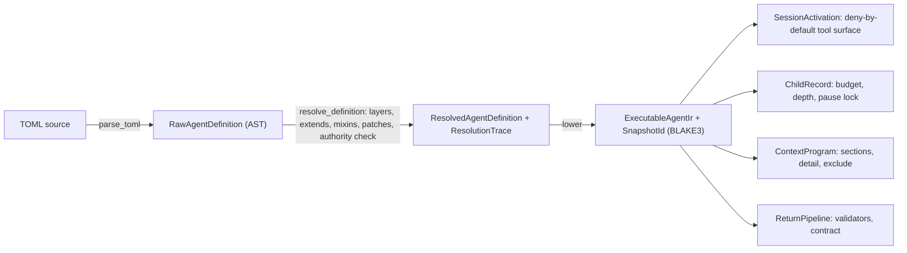
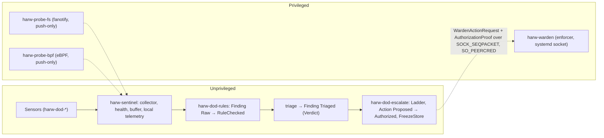
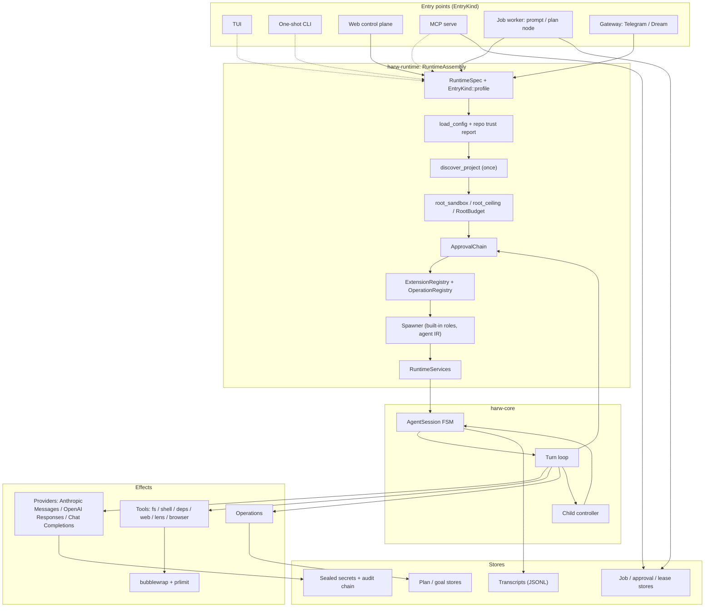

# Harwness

**A local agent operating environment in Rust. It combines a standalone agent harness, a compiled agent-definition language, a privilege-separated host-security plane, durable plans, jobs and knowledge, and an embeddable SDK in one layered crate workspace. In every part the model proposes, and the runtime decides.**

> [!WARNING]
> **Harwness is in active development and restructuring.** It is going through a security remediation program and a consolidation that routes every entry point through a single `RuntimeAssembly`.
>
> **It is not a plug-and-play agentic AI tool.** Expect breaking API changes without deprecation, subsystems that are built but not yet wired into a production entry point, and a workspace that is **not guaranteed to build or run at every commit**.
>
> Harwness is aimed at **developers who want to study, embed or contribute to** a security-first agent runtime. It is not meant for end users looking for a ready-made assistant. See the [Roadmap](#roadmap) for what is landed, in progress and planned.

Harwness (binary: `harw`) runs LLM agents as supervised, durable work. A model call produces *intent*: a message, a tool call or a spawn request. Everything with side effects goes through Rust code the model cannot bypass. That covers file access, process execution, network egress, child agents, jobs, plans, memory, approvals, secrets and even the host the agent runs on.

The workspace has **97 crates** and roughly **350,000 lines of Rust** (inline tests and documentation included). Throughout this document, capabilities are marked as **wired** (reachable from a production entry point), **built** (implemented and tested, not yet connected) or **planned**.

---

## Contents

1. [What makes Harwness unique](#what-makes-harwness-unique)
2. [The Agent DSL](#the-agent-dsl)
3. [Defense-on-Device (DoD)](#defense-on-device-dod)
4. [Why "just an agent harness" undersells it](#why-just-an-agent-harness-undersells-it)
5. [The SDK](#the-sdk)
6. [Architecture](#architecture)
7. [Runtime subsystems](#runtime-subsystems)
8. [Crate inventory](#crate-inventory)
9. [Getting started](#getting-started)
10. [Configuration](#configuration)
11. [Bedienung der TUI](#bedienung-der-tui)
12. [Lebensdauern (Scopes von Einstellungen)](#lebensdauern-scopes-von-einstellungen)
13. [Development](#development)
14. [Roadmap](#roadmap)
15. [Repository layout](#repository-layout)
16. [License](#license)

---

## What makes Harwness unique

Many agent frameworks give a model a loop, some tools and a shell. Harwness is built on a different assumption: **authority is a runtime property that must be derived, reduced and proven, never declared by a prompt, a config file or a model.** The points below show what follows from that, each with the code location that implements it.

| # | Property | Evidence in code |
|---|---|---|
| 1 | **One reduction table for all rights.** Eleven entry kinds (TUI, one-shot, web, MCP, job worker, gateways, …) name only their `EntryKind`. Sandbox permissions, tool registry, operation surface, ask resolution, spawner and context ceiling are derived from **one** `match`. A tabular test checks the resulting rights for every entry kind. | `harw-runtime/src/spec.rs` (`EntryKind::profile`), `harw-runtime/tests/rights_matrix.rs` |
| 2 | **Agents are compiled, not prompted.** Agent definitions are TOML programs that pass through a four-stage compiler (parse → resolve → lower → runtime effect). The result is an `ExecutableAgentIr` with a **content-addressed BLAKE3 snapshot ID**. Roles are a closed Rust enum, and the spawn matrix cannot be changed from TOML. | `harw-agent-dsl/src/{parse,resolve,executable,roles}.rs`, `executable.rs:585` (`SNAPSHOT_HASH_DOMAIN`), `executable.rs:1213` (`lower`) |
| 3 | **Authority can only shrink.** Definition inheritance rejects capability elevation at compile time (`DslError::AuthorityElevation`). Session tool surfaces are deny-by-default and built from the IR. Interaction modes intersect with the base surface instead of replacing it. Child principals are capped at `Operator`. | `harw-agent-dsl/src/resolve.rs:261`, `harw-core/src/session.rs:405`, `harw-types/src/principal.rs:175` |
| 4 | **Approval handlers can only restrict.** Every handler is consulted exactly once per tool call and the results aggregate as `Deny` > `AskUser` > `Allow`. A handler added later can tighten the policy, but never loosen it. | `harw-core/src/turn_loop.rs:490` (`check_approval`) |
| 5 | **Permission checks run before parsing.** The `#[tool]` proc macro generates an executor that checks the sandbox permission *before* model-controlled arguments are deserialized, and fails closed when a URL host cannot be extracted. An unknown permission string is a compile error. | `harw-macros/src/lib.rs:148-230` |
| 6 | **Identities cannot be forged over the wire.** `Principal { kind, id, surface, tier }` implements `Serialize` but deliberately not `Deserialize`. Only composition roots construct it. | `harw-types/src/principal.rs:110-128` |
| 7 | **Security actions are typestates.** A host-security finding moves through `Finding<Raw>` → `Finding<RuleChecked>` → `Finding<Triaged>`, and only the rules crate can construct the intermediate states. `Action<Authorized>` can only be built inside the escalation crate. The privileged Warden verifies a proof bound to the **content digest of the exact action**. | `harw-dod-rules/src/finding.rs:386,439,546`, `harw-dod-escalate/src/action.rs:259`, `harw-dod-warden-proto/src/proof.rs:279` |
| 8 | **The agent runtime watches its own host.** Unprivileged sensors, push-only privileged probes (fanotify, eBPF) and a separate socket-activated enforcer are part of the same workspace, with dependency gates applied to the enforcer. | `harw-dod-*`, `harw-sentinel`, `harw-warden`, `xtask/src/gate_warden.rs` |
| 9 | **Context is a typed, golden-tested program.** Context sections carry a trust class (`instruction` / `evidence` / `data`), a strength and a detail mode, are admitted against a ceiling, and are pinned by golden render files. | `harw-agent-dsl/src/context_program.rs`, `harw-registry-defaults/agents/context-programs/golden/` |
| 10 | **Post-quantum secrets and a tamper-evident audit log.** Per-secret keys are sealed under a hybrid **ML-KEM-1024 + P-384** KEK. The audit log is hash-chained with **ML-DSA-signed** checkpoints. | `harw-secrets/src/{policy,kek,envelope,audit}` |
| 11 | **Architecture-correct, symlink-proof file access.** `O_NOFOLLOW` comes from `rustix`, so it is correct on aarch64 as well. Containment uses `openat2(RESOLVE_BENEATH \| RESOLVE_NO_SYMLINKS)`, and directory walks never follow symlinks and detect cycles by `(dev, ino)`. | `harw-fsutil/src/{open,walk}.rs` |
| 12 | **No `unsafe`, workspace-wide.** `unsafe_code = "forbid"` is set in `[workspace.lints]` and cannot be overridden per crate. | `Cargo.toml` |

---

## The Agent DSL

`harw-agent-dsl` implements the Harwness **Agent Definition DSL** (normative specification: `agent-definition-dsl.md`, compiler stages: `docs/design/agent-ir-v1.md`). An agent in Harwness is not a system prompt with a tool list. It is a **versioned, namespaced definition** that is resolved through layers, checked for authority monotonicity, lowered into a runtime-shaped IR and frozen into a content-addressed snapshot. The runtime enforces that snapshot.

### Four orthogonal dimensions

| Dimension | Meaning | Configurable from TOML? |
|---|---|---|
| **Role** | Authority and position in the orchestration tree | Select only, from a closed Rust enum |
| **Lifecycle** | defined → provisioned → running → completed / failed / cancelled | Constrained (pause lock, rerun, attempts) |
| **Specialization** | Work contract, tools, context, model policy, return schema | Yes, extensively |
| **Organization** | Family, clan, cell, parent, run-tree membership | Yes |

### Closed roles and the spawn matrix

Roles are sealed in Rust (`harw-agent-dsl/src/roles.rs`):

```rust
pub enum AgentRoleId { UserInterface, RootOrchestrator, ChildOrchestrator, Worker }
```

`can_spawn(caller, target)` implements the normative matrix, and the child controller calls it before admitting a child (`harw-core/src/child_controller.rs:1718`):

| Caller \ Target | Root orchestrator | Child orchestrator | Worker | Agent tool |
|---|:---:|:---:|:---:|:---:|
| User interface | yes | no | no | by policy |
| Root orchestrator | no | yes | yes | yes |
| Child orchestrator | no | yes (within depth) | yes | yes |
| Worker | no | no | no | yes |

No definition, family, mixin, plugin or organization template can override this table.

### A real definition

The built-in read-only explorer (`harw-registry-defaults/agents/explorer.toml`, comments trimmed):

```toml
schema = "harwness.agent/v1"
id = "harwness.agent.explorer@1"
version = "1.0.0"
extends = { id = "harwness.agent.worker-base@1" }
role = "worker"
specialization = "explorer"

name = "Explorer"
description = "Read-only exploration of the workspace and dependency sources; returns evidenced findings."

[work]
mode = "read-only-exploration"
may_write_code = false
may_research_web = false

[tools]
admitted = [
  "fs.read", "fs.list", "fs.search", "fs.glob", "fs.grep",
  "deps.graph", "deps.locked", "deps.source_read", "deps.source_search", "deps.source_list",
]
forbidden = ["fs.write", "shell.exec", "web.fetch", "web.docs_rs", "web.crates_io"]

[spawn]
max_depth = 1

[spawn.budget]
max_tokens = 60000
max_tool_calls = 40
max_wall_secs = 180

[return]
contract = "harwness.return.research-finding@1"
```

It inherits lifecycle and context rules from its single structural base (`worker-base.toml`):

```toml
schema = "harwness.agent/v1"
id = "harwness.agent.worker-base@1"
version = "1.0.0"
role = "worker"
specialization = "worker-base"

[lifecycle]
allow_pause = false   # a lock, not a hint: a read-only child has no channel for approvals
allow_rerun = true
max_attempts = 2

[context]
must_include = ["task.objective", "task.read_scope", "new.trigger_return"]
exclude = ["full_parent_transcript", "sibling_transcripts"]
```

Built-in definitions shipped today: `worker-base`, `explorer`, `planner`, `analyst`, `researcher-deps` and `researcher-web`. There are also the `coding` and `research` families, a `security` family with context-steward, intel-scout and four security triage roles, and a default organization. All of them are embedded with `include_dir!` from `harw-registry-defaults/agents/` and compiled at startup (`harw-registry-defaults/src/embedded_agents.rs`).

### Layers, inheritance and explicit merges

Definitions are resolved through ordered layers (`harw-agent-dsl/src/layers.rs`):

```text
BuiltIn (0) < InstalledPack (1) < UserGlobal (2) < Workspace (3) < Project (4) < RunLocal (5)
```

- **Single base plus ordered mixins.** Each definition has at most one `extends` and any number of role-constrained mixins, applied in declaration order.
- **Explicit merge operations** (`harw-agent-dsl/src/merge.rs`): `Replace`, `Append`, `Prepend`, `Remove`, `Intersect`. Authority-bearing fields accept **only** `Intersect` and `Remove`.
- **Authority monotonicity.** `[authority].capabilities` of a derived definition must be a subset of the inherited set (`AuthorityCeiling::is_reduction_of`). An added capability aborts resolution with `DslError::AuthorityElevation`, naming the definition, the added capabilities and the field location (`resolve.rs:261`).
- **Provenance.** Every resolution step is recorded in a `ResolutionTrace`, so validation errors can explain inheritance and source.
- **Run-local overrides** live in the run snapshot and are never silently written back to TOML.

### The compiler pipeline



`lower` (`executable.rs:1213`) is a pure function. It produces an `ExecutableAgentIr` with six runtime-facing parts:

| IR component | Source section | Carries |
|---|---|---|
| `SpawnContract` | `[spawn]`, `[spawn.budget]` | workspace hint, `max_depth`, `BudgetSpec { max_tokens, max_tool_calls, max_wall_secs, effort_cap }` |
| `JobTemplate` | `[job]` | symbolic goal kind |
| `ContextProgram` | `[context]` + context program | policy label, `must_include`, `exclude`, per-section `DetailMode` |
| `ResolvedToolSurface` | `[tools]` | `admitted`, `forbidden` |
| `LifecycleMachine` | `[lifecycle]` | `allow_pause`, `allow_rerun`, `max_attempts` |
| `ReturnPipeline` | `[return]` | ordered validators, return `contract` |

Some semantics are deliberately strict:

- In a budget, `None` means *no statement* (the runtime applies its own conservative default) and `Some(0)` means *hard zero*. `None` never means unlimited.
- A value with the wrong TOML type counts as **absent**. The typed IR never invents values, and `allow_pause` falls back to `false`, which is the fail-closed direction.
- `effort_cap` and `contract` are opaque labels that the consumer must reject fail-closed when it does not recognize them.
- **`SnapshotId`** is a BLAKE3 digest over a hand-written, length-prefixed byte stream of the IR's content fields under a versioned domain tag (`harwness.executable-ir.snapshot/v3`). The wall-clock trace is excluded, so re-lowering the same definition later yields the same ID. `SnapshotId` has no public text constructor and no `Deserialize`. Identities read from outside arrive as `ReferencedSnapshotId` and must be `confirm`ed against a freshly computed ID.

### Context programs

Context programs are a separate definition class (`harwness.context/v1`, `harw-agent-dsl/src/context_program.rs`) with a closed grammar (`deny_unknown_fields`). Each `[[sections]]` entry declares:

| Field | Values | Meaning |
|---|---|---|
| `name` | e.g. `task.objective`, `history.tail`, `repo.tree` | section selector |
| `strength` | `normal` / `must-include` | whether it may be dropped under budget pressure |
| `detail` | `full` / `summary` / `references` | render mode |
| `trust` | `instruction` / `evidence` / `data` | minimum trust class the section claims |

Real example (`harw-registry-defaults/agents/context-programs/explore.toml`):

```toml
schema = "harwness.context/v1"
id = "harwness.context.explore@1"
version = "1.0.0"
extends = { id = "harwness.context.base@1" }

exclude = ["plan.*"]   # an explorer must not lean on the plan

[[sections]]
name = "task.read_scope"
strength = "must-include"
detail = "full"
trust = "data"         # the boundary is a constraint, not an instruction

[[sections]]
name = "repo.tree"
strength = "normal"
detail = "summary"
trust = "evidence"
```

Resolution keeps declaration order across `extends` → mixins → own sections → patches. The resolved order from the golden file is:

```text
1. task.objective   must-include  full     instruction  [from base]
2. history.tail     must-include  summary  evidence     [from base]
3. task.read_scope  must-include  full     data         [from explore]
4. repo.tree        normal        summary  evidence     [from explore]
Exclude: plan.*
```

A resolved program is checked against a `ContextCeiling` (`ContextCeilingAdmission`, `resolve_context_program_within_ceiling`). A program that asks for more trust than the ceiling allows is rejected. Ten programs ship today: `base`, `explore`, `research-deps`, `research-web`, `plan`, `implement`, `review`, `triage`, `curate` and `orchestrate`. Each has a golden render verified against `render_context_program`.

### Families and organizations

Families are reusable design bundles with invariants. Organizations describe a run tree made of a root, clans and cells.

```toml
# harw-registry-defaults/agents/families/security/security.toml
schema = "harwness.family/v1"
id = "harwness.family.security@1"
invariants = [
  "universe_disjoint_from_other_families",
  "triage_never_calls_productive_tools",
  "verdicts_are_proposals_never_commits",
]

[universe]
capabilities = [
  "security.advisory.correlate", "security.context.curate", "security.context.read",
  "security.scanreport.read", "security.sensor.read", "security.verdict.propose",
]

[workers]
allowed = [
  "harwness.agent.security-egress-triage@1", "harwness.agent.security-baseline-triage@1",
  "harwness.agent.security-structure-triage@1", "harwness.agent.security-endpoint-triage@1",
]
```

`AuthorityCeiling::is_disjoint_from` checks that the security family's capability universe does not overlap with other families. That removes any path from attacker-controlled security input to productive tools in another family.

```toml
# harw-registry-defaults/agents/organization/default.toml (excerpt)
schema = "harwness.organization/v1"
id = "harwness.organization.default@1"

[root]
agent = { id = "harwness.agent.analyst@1" }
family = { id = "harwness.family.research@1" }

[[clans]]
id = "coding"
leader = { id = "harwness.agent.planner@1" }
family = { id = "harwness.family.coding@1" }
plan_scope = "coding-*"

[[cells]]
id = "research-wave"
clan = "research"
kind = "fanout"
barrier = "all-terminal"
write_partition = "required"
members_from_plan = "research-*"
```

Cells are temporary fan-out batches bound to plan nodes (`harw_plan_bridge::CellPlan::from_cell`). Organizations never create additional roots.

### How the runtime enforces a definition

| Declaration | Enforcement point | Status |
|---|---|---|
| `role` | Closed enum; `can_spawn` checked at child admission (`child_controller.rs:1718`) | Wired |
| `[tools].admitted` / `forbidden` | `AgentSession::with_executable_agent_ir` builds a **deny-by-default** `SessionActivation` stored as the base activation. `/mode` intersects with it and cannot re-enable forbidden tools (`session.rs:405`). The same surface is computed for child registries in `harw-runtime`. | Wired |
| `[spawn.budget]` | Copied into the child's `AgentBudget` at admission (`child_controller.rs:1667`) | Wired; strict in-turn budget enforcement and root budgets are part of P1.3 |
| `[spawn].max_depth` | Additional, only-tightening depth limit below the controller's global limit | Wired |
| `[lifecycle].allow_pause = false` | Pause lock in the `ChildRecord`: a child that would wait for approval or for its own child is rejected fail-closed instead of hanging (`child_controller.rs:1355`) | Wired |
| `[authority].capabilities` | Monotonicity at resolution time (`AuthorityElevation`) | Compile-time wired; intersecting the ceiling with the live tool surface at runtime is planned |
| `[context]` / context program | Resolved, ceiling-checked, carried in the IR, rendered into instruction and data blocks | Built; delivery of the data block through every provider wire format is planned (P1.2) |
| `[return].contract` | Label carried in the IR; research returns are schema-validated in `harw-research` | Partial |
| `[work]` flags | Declarative work contract, made true by the tool surface (for example, the planner has no executor for `plan`/`goal`) | Descriptive |
| Snapshot | `executable_snapshot_id()` kept on the session for audit and correlation | Wired |

---

## Defense-on-Device (DoD)

An agent that can run code on a machine should not be the only thing watching that machine. The DoD subsystem observes the host the harness runs on, detects suspicious state and turns confirmed findings into **authorized, bounded enforcement actions**. It is split strictly by privilege, and at every hop the *type system* carries the authorization rule.

### The chain



Solid edges are implemented within their crates. Dashed edges are the cross-process wiring the roadmap completes.

### Components

**Access and signal vocabulary**

| Crate | Role |
|---|---|
| `harw-dod-cap` | Sensor access vocabulary: every sensor binds a `Capability` and a `ReadScope` into a `SensorHandle` at construction, so a sensor cannot read outside its declared scope. |
| `harw-dod-readfs` | The **only** filesystem seam for sensors: typed reads under a `ReadScope`. |
| `harw-dod-signals` | Readings, `SecurityEvent`s, evidence (`Hardness`: Observed / Correlated / Inferred; `Severity`), verdict schema and the single `Sensor` trait. |
| `harw-dod-netlink` | Netlink access behind a trait (audit backend). |
| `harw-dod-bpf` | eBPF loading layer behind a trait. |
| `harw-dod-fixtures` | `sensor_suite!` fixture harness applied uniformly to all sensors. |

**Sensors** (each implements `Sensor` for exactly one source)

| Crate | Source |
|---|---|
| `harw-dod-thermal` | `/sys/class/thermal` |
| `harw-dod-cpu` | `/proc/stat` |
| `harw-dod-memory` | `/proc/meminfo` |
| `harw-dod-blockio` | block device `stat` in sysfs |
| `harw-dod-netcounters` | `/proc/net/dev` |
| `harw-dod-gpu` | `/sys/class/drm` |
| `harw-dod-cgroup` | cgroup v2 under `/sys/fs/cgroup` |
| `harw-dod-listener` | open listening sockets with cgroup attribution |
| `harw-dod-authlog` | login events with `auid` via audit netlink |
| `harw-dod-scanreport` | reports of external scanners (reads, never invokes) |
| `harw-dod-workspace` | structural drift in the Cargo dependency graph as a security signal |
| `harw-dod-fsmon` | fanotify filesystem watcher (library half of the fs probe) |
| `harw-dod-procmon` | process-start events via eBPF |
| `harw-dod-flow` | connection events via eBPF |

**Collection**

- **`harw-dod-sentinel` / `harw-sentinel`**: the unprivileged collector. It registers only unprivileged sensors (a test asserts this), polls them, tracks sensor health (including `SensorDegraded` events), buffers readings and writes to the local JSONL telemetry sink. Without Landlock it **degrades instead of refusing to start**, because its permission set is small to begin with.
- **`harw-probe-fs`**: a push-only fanotify probe that holds `CAP_SYS_ADMIN`. Here Landlock is the only barrier that enforces the declared `ReadScope`, so the probe **refuses to run** unless Landlock is fully enforced.
- **`harw-probe-bpf`**: a push-only eBPF probe (process and flow events) with its own Landlock module.

**Decision**

- **`harw-dod-rules`**: rules (`baseline_deviation`, `egress_flow`, `structure_drift`), advisories, confidence and baselines. It owns the finding typestate: `Finding::raw` and `Finding::check` are `pub(crate)`, so a `Finding<RuleChecked>` cannot exist outside this crate. `triage(Finding<RuleChecked>, Verdict) -> Finding<Triaged>` is the only way forward, with `Verdict::{Confirmed, FalsePositive, NeedsReview}`.
- **`harw-dod-escalate`**: the escalation ladder, and the **single place where a finding becomes an authorized action**. `Action::authorize` is `pub(crate)`. There is no public constructor, no `From` and no `Deserialize` for `Action<S>`, and a `compile_fail` doctest proves it. The stage rule is a pure function of finding fields (no clock, no randomness, no history):
  - `RuleTriggered` requires a triggered rule (not an anomaly) with `Verdict::Confirmed`.
  - `Escalated` additionally requires `Severity::Critical` **and** `Hardness::Observed`.
  - Freeze and release decisions are written to a durable `FreezeStore` **before** any fallible check, so a failed authorization still leaves an audit record.
- **`harw-dod-netpolicy`**: network rule plans as pure data. It describes rules and never applies them.

**Enforcement**

- **`harw-dod-warden-proto`**: the wire protocol between escalation and Warden. `WardenAction` is one of `FreezeCgroup`, `ReleaseCgroup`, `IsolateNetwork` or `KillProcessTree`. Admissibility is stage-gated: freeze and release are allowed from `RuleTriggered`, while isolate and kill require `Escalated`.
- **`AuthorizationProof`** binds five mandatory fields: the `FindingId`, the `EscalationStage`, the authorizing `ApprovalActor`, the time of authorization and the **`ContentDigest` of the exact `WardenAction`**. A proof for "some freeze" can therefore not be reused for a different cgroup. `verify()` checks the binding and then the admissibility at the stated stage. The constructor makes no decisions and reads no clock.
- **`harw-dod-warden` / `harw-warden`**: the single privileged enforcer. It is socket-activated by systemd and accepts `SOCK_SEQPACKET` connections, authenticating peers by kernel credentials (`SO_PEERCRED`). The `warden-deps` and `warden-cbuild` gates keep its dependency budget small and free of C build steps.
- **`harw-dod`**: the subsystem facade.

Systemd units for Sentinel, Warden (service and socket) and both probes are in `deploy/systemd/`, and `harw-install` renders DoD units.

### Target design (planned)

The crates above are implemented and tested individually. **The end-to-end chain is not yet wired into a production process.** The remediation program completes it:

- **Finding spool and triage**: `FindingRecord` plus an on-disk `FindingSpool` written by the Sentinel. A read-only, network-less triage child role produces a `Verdict` that is bound to the record digest (`triage_record`).
- **Escalator daemon** (`harw-escalator`, new): its own system user, a submission socket, reads the spool itself, signs proofs and acts as the Warden client, including freeze expiry.
- **Warden proof v2**: keyed BLAKE3 over canonical, length-prefixed bytes (domain `harw:warden-proof:v2`), with key IDs and rotation. The verification order is peer UID → version → key ID → MAC → time window (TTL ≤ 120 s) → action digest → stage → cgroup prefix allowlist → nonce persisted with `fsync` *before* execution.
- **Enforcement policy**: freeze and release run automatically after proof verification. Kill requires explicit human approval and is off by default. `IsolateNetwork` is answered as `Unsupported`.
- **Audit probe** (`harw-probe-audit`, new): a kernel audit netlink reader with correct message typing and batching.
- **Probe hardening**: eBPF load and attach before capability drop and Landlock, fixed tracepoint offsets without BTF, and Landlock degradation where the kernel lacks it.
- **Real host captures** from the reference platform (Raspberry Pi 5, kernel 6.18) as fixtures, including sysfs symlink aliases.
- **`harw dod install`**: system users, groups, runtime directories and key generation.

---

## Why "just an agent harness" undersells it

Harwness **works as a standalone agent harness**. `harw` gives you a TUI chat, one-shot prompts, sandboxed tools, approvals, sessions and child agents. The code, however, contains several systems that a harness in the usual sense (a loop that drives a model and executes its tool calls) does not have:

| A harness typically has | Harwness additionally has | Where |
|---|---|---|
| A tool-calling loop | A **language and compiler** for agents: layered definitions, explicit merge algebra, authority monotonicity, content-addressed IR snapshots, families, organizations, clans and cells | `harw-agent-dsl`, `harw-registry-defaults/agents/` |
| Maybe a sandbox | A **host-security plane** of 31 crates: sensors, rules, typestate escalation, push-only privileged probes, a separate enforcer with its own authenticated wire protocol and systemd units | `harw-dod-*`, `harw-sentinel`, `harw-warden`, `harw-probe-*`, `deploy/systemd/` |
| Chat history | A **durable work substrate**: a versioned plan/goal graph with reconciliation, jobs with budgets, leases and retries, plan-node jobs, an MCP job-submission authority, a durable approval store | `harw-plan`, `harw-plan-bridge`, `harw-job-runtime`, `harw-session-store`, `harw-mcp-server` |
| A memory file | A **memory and knowledge pipeline**: tiered working memory with signals and promotion, a curated artifact store (diary, dream, workbench, Kanban, security baselines, proposals with a steward) and an eleven-crate retrieval stack | `harw-memory`, `harw-knowledge`, `harw-lens*` |
| One CLI entry point | A **multi-entry runtime**: eleven entry kinds, daemons (gateway, job worker), services for systemd/launchd/schtasks, one rights table across all of them | `harw-runtime`, `harw-cli`, `harw-install` |
| Environment-variable API keys | **Sealed post-quantum secrets** with a hash-chained, ML-DSA-checkpointed audit log | `harw-secrets` |
| An application | An **embeddable library surface**: the `harw` SDK facade, contributor traits, proc macros for tools and operations | `harw`, `harw-extension-api`, `harw-macros` |

The project's architecture synthesis uses the term that best fits the code: a **local, model-heterogeneous agent operating environment** with a control plane, a durable job runtime, capability provisioning, a knowledge system and interchangeable clients (`philosophy.md` §17). The standalone harness is one of its interfaces, not its whole scope.

---

## The SDK

> [!CAUTION]
> **The SDK API is unstable.** Version `0.x`: every signature below can change without deprecation while the remediation program is underway. Blocks marked *existing API* compile against items that exist in the repository today (paths are cited). Blocks marked *planned API* show the roadmap design and **do not compile yet**.

Harwness is designed to be embedded. Three layers are available:

1. **`harw`**: the facade crate, described as "the single crate external users depend on" (`harw/Cargo.toml:6`). Today it re-exports `extension`, `ops` (+ `ops::builtins`), `agent`, `provider`, `model`, `core`, `defaults`, `types`, `plan`, `plan_bridge`, `research`, `code_graph`, `sandbox` and a hand-curated `prelude` (`harw/src/lib.rs`, `harw/src/prelude.rs`).
2. **`harw-runtime`**: the composition root (`RuntimeAssembly`) used by the production entry points. It is not re-exported by the facade yet, so depend on it directly.
3. **Extension points**: `harw-extension-api` contributor traits (`ToolProvider`, `ContextProvider`, `InstructionsProvider`, `ApprovalHandler`, `TurnObserver`, `AgentSpawner`), `harw-runtime`'s `AssemblyContributor`, and the `harw-macros` proc macros `#[tool]`, `#[derive(Tool)]`, `#[operation]` and `#[derive(FromRawArgs)]`.

Crates are not published to a registry yet. Use path or git dependencies.

### Example 1: Compose built-ins and compile an agent definition (existing API)

Based on `harw/examples/minimal.rs` (`cargo run -p harw --example minimal`) and the DSL doctests (`harw-agent-dsl/src/executable.rs`). `resolve_definition` takes a `time::OffsetDateTime`, so the example also depends on the `time` crate.

```rust
use harw::prelude::*;
use harw::agent::{executable::lower, ids::DefinitionId, layers::DefinitionLayer,
                  parse::parse_toml, resolve::resolve_definition};

const AGENT: &str = r#"
schema = "harwness.agent/v1"
id = "harwness.agent.my-reviewer@1"
version = "1.0.0"
role = "worker"
specialization = "my-reviewer"

[tools]
admitted = ["fs.read", "fs.grep"]
forbidden = ["fs.write", "shell.exec"]

[lifecycle]
allow_pause = false
"#;

fn main() -> Result<(), Box<dyn std::error::Error>> {
    // Built-in operations (commands + model tools).
    let mut ops = OperationRegistry::new();
    harw::ops::builtins::register_all(&mut ops);
    println!("{} built-in operations", ops.len());

    // Default coding-agent registry (fs + shell tools, baseline instructions).
    let assembled = harw::defaults::assemble_default_registry(std::env::current_dir()?)?;
    println!("{} tool providers", assembled.registry.tool_providers().len());

    // TOML → AST → resolved IR → executable IR.
    let raw = parse_toml(AGENT)?;
    let id = DefinitionId::parse("harwness.agent.my-reviewer@1")?;
    let resolved = resolve_definition(&id, &[(DefinitionLayer::BuiltIn, raw)],
                                      time::OffsetDateTime::now_utc())?;
    let ir: ExecutableAgentIr = lower(&resolved)?;

    println!("snapshot {}", ir.snapshot_id());          // content-addressed BLAKE3 digest
    println!("admitted {:?}", ir.tool_surface().admitted());
    Ok(())
}
```

### Example 2: Embed a runtime and run a turn (existing API)

Mirrors `harw-runtime/tests/rights_matrix.rs` and `harw-cli/src/runtime_entry.rs`. It uses the offline echo model, so it makes no network call.

```rust
use std::sync::Arc;
use harw_core::{run_turn, InMemoryStateStore, StateStore, TurnInput};
use harw_runtime::{EntryKind, ModelSource, RuntimeAssembly, RuntimeSpec, RuntimeStores};
use harw_types::{IngressSurface, PermissionTier, Principal, PrincipalKind};

#[tokio::main]
async fn main() -> Result<(), Box<dyn std::error::Error>> {
    let spec = RuntimeSpec {
        entry: EntryKind::OneShot,                      // rights come ONLY from EntryKind::profile()
        home: std::env::temp_dir().join("harw-embed"),
        cwd: std::env::current_dir()?,
        principal: Principal::trusted_ingress(
            PrincipalKind::Human, "embedder", IngressSurface::Cli, PermissionTier::Operator,
        ),
        mode_override: None,
        active_agent: None,
        reasoning_effort: None,
    };

    let (events, _events_rx) = tokio::sync::mpsc::unbounded_channel();
    let (turn_events, _turn_rx) = tokio::sync::mpsc::unbounded_channel();
    let state_store: Arc<dyn StateStore> = Arc::new(InMemoryStateStore::new());

    let assembly = RuntimeAssembly::builder(spec)
        .model(ModelSource::Echo("hello from echo".to_owned()))  // or ModelSource::Configured
        .stores(RuntimeStores { state_store, job_store: None, approval_store: None })
        .session_events(events.clone())                // required for entries with a spawner
        .build()?;

    // Side-effect-free view of the effective rights of this run.
    let rights = assembly.rights_snapshot();
    println!("permissions={:?} tools={} chain={:?}",
             rights.permissions, rights.tools.len(), rights.approval_chain);

    // The one root session; OneShot resolves "ask" by rejecting, so no responder.
    let mut root = assembly.new_root_session(
        assembly.root_session_id().clone(), events, turn_events, None,
    )?;

    let outcome = run_turn(
        &mut root.session,
        &**assembly.model(),
        &**assembly.state_store(),
        TurnInput::user("Summarize this repository."),
    ).await?;
    println!("{outcome:?}");

    assembly.close_session(assembly.root_session_id());
    Ok(())
}
```

`run_turn` is the lightweight entry point. Production channels use `run_turn_durable`, which records every approval request durably before it is exposed.

### Example 3: Register a custom tool (existing API)

Uses the same pattern as `harw-tool-web/src/{docs_rs,provider}.rs`: `#[derive(Tool)]` for the argument schema, `#[harw_macros::tool]` for the executor (with the permission check before deserialization) and `harw_tools::tool_provider!` for the provider. Required dependencies are `harw-macros`, `harw-tools`, `harw-extension-api`, `serde` and `serde_json`.

```rust
use harw_macros::Tool;
use harw_tools::{ToolExecutionContext, ToolOutput, ToolsError};
use serde::Deserialize;

/// Arguments of `repo.line_count`.
#[derive(Debug, Clone, Tool, Deserialize)]
#[tool(name = "repo.line_count", description = "Counts lines of a workspace file.")]
pub struct LineCountArgs {
    /// Workspace-relative path.
    pub path: String,
}

#[harw_macros::tool(
    name = "repo.line_count",
    description = "Counts lines of a workspace file.",
    permission = "read_workspace",   // checked BEFORE `args` is deserialized; typos are compile errors
    parallel_safe
)]
async fn repo_line_count(
    _context: &ToolExecutionContext,
    args: LineCountArgs,
) -> Result<ToolOutput, ToolsError> {
    // Real code must resolve `args.path` beneath the workspace root (see harw-fsutil::open_beneath).
    Ok(ToolOutput::text(format!("would count lines of {}", args.path)))
}

harw_tools::tool_provider! {
    /// Provides `repo.line_count`.
    pub struct RepoToolProvider { RepoLineCountTool }
}
```

The macro generates `RepoLineCountTool` from the function name. To add the provider to every run, contribute it during assembly. Contributors run after the approval chain is installed (assembly step 10) and fail closed on error:

```rust
use std::sync::Arc;
use harw_runtime::{AssemblyContributor, AssemblyInputs, AssemblyParts, RuntimeResult};

struct RepoTools;

impl AssemblyContributor for RepoTools {
    fn contribute(&self, _inputs: &AssemblyInputs<'_>, parts: &mut AssemblyParts) -> RuntimeResult<()> {
        let registry = std::mem::take(&mut parts.registry);   // ExtensionRegistryBuilder: Default
        parts.registry = registry.tool_provider(Arc::new(RepoToolProvider));
        Ok(())
    }
}

// RuntimeAssembly::builder(spec).contributor(Arc::new(RepoTools)) ...
```

A new tool is **not** auto-approved. The default policy only exempts a fixed read-only allowlist, and an active agent definition must also list the tool in `[tools].admitted`.

### Example 4: Register a custom operation (existing API)

`#[operation]` exposes one async function on several surfaces: slash command, model tool, agent tool and web route. The pattern follows `harw-ops/src/status.rs`.

```rust
use std::sync::Arc;
use harw_macros::operation;
use harw_operations::{OpContext, OpError, OpOutput};

#[derive(Default, serde::Deserialize, harw_macros::FromRawArgs)]
pub struct WhoamiArgs {}

#[operation(
    name = "whoami",
    summary = "Shows the sandbox workspace and permission count.",
    domain = "session",                 // session | agents | execution | catalog_config | knowledge | misc
    permission = "observer",            // observer | operator | maintainer | owner
    command(path = "/whoami", visibility = "channel_parity"),
    model_tool(readonly, approval = "none"),
)]
async fn whoami(ctx: &OpContext, _args: WhoamiArgs) -> Result<OpOutput, OpError> {
    let sandbox = ctx.sandbox();
    Ok(OpOutput {
        text: format!("workspace {} with {} permissions",
                      sandbox.workspace().workspace(), sandbox.permissions().iter().count()),
    })
}

// Generated: `pub struct WhoamiOperation;` implementing `harw_operations::Operation`.
// Inside an AssemblyContributor:  parts.operations.register(Arc::new(WhoamiOperation));
```

### Example 5: Sandbox and approval hooks (existing API)

```rust
use harw::extension::{ApprovalDecision, ApprovalHandler, ExtFuture, ToolCall};
use harw::extension::contributors::ApprovalHandlerKind;
use harw::sandbox::{Permission, PermissionSet};
use harw_runtime::{permissions_for_tier, EntryKind};
use harw_sandbox::egress::{host_matches_suffix, EgressUrl};
use harw_types::PermissionTier;

/// Denies any shell command that mentions `curl`. Handlers are consulted once per call and
/// aggregated Deny > AskUser > Allow, so this handler can only tighten the chain.
struct NoCurl;

impl ApprovalHandler for NoCurl {
    fn review<'a>(&'a self, call: &'a ToolCall) -> ExtFuture<'a, ApprovalDecision> {
        Box::pin(async move {
            if call.name.as_str() == "shell.exec" && call.arguments.to_string().contains("curl") {
                ApprovalDecision::Deny("curl is not permitted".to_owned())
            } else {
                ApprovalDecision::Allow
            }
        })
    }
    fn kind(&self) -> ApprovalHandlerKind { ApprovalHandlerKind::Other }
    fn label(&self) -> &'static str { "no-curl" }   // `review` must be side-effect free
}

fn inspect() {
    // Rights are a lattice: reduction only.
    let tui = EntryKind::Tui.profile().permissions;
    let web = EntryKind::Web.profile().permissions;
    assert!(web.is_subset_of(&tui));
    assert!(!tui.contains(Permission::NetworkAccess));          // no entry kind grants network
    let observer: PermissionSet = permissions_for_tier(PermissionTier::Observer);
    let _effective = tui.intersection(&observer);

    // Egress parsing follows WHATWG, not naive string splitting.
    let url = EgressUrl::parse("https://evil.com\\@docs.rs/").expect("parses");
    assert_eq!(url.host_str(), "evil.com");
    assert!(!host_matches_suffix("docs.rs", &url.host_str()));
}

// Registration inside an AssemblyContributor:
//   parts.registry = std::mem::take(&mut parts.registry).approval_handler(Arc::new(NoCurl));
```

### Example 6: The planned `Harness` / `Session` API (planned API, roadmap P2 "SDK")

> [!NOTE]
> **Planned API. This does not compile today.** It shows the target facade design: curated modules instead of glob re-exports, crate-owned newtypes and an embedded entry kind.

```rust
// PLANNED — not yet implemented.
use harw::{Harness, Session, EntryKind};

#[tokio::main]
async fn main() -> Result<(), harw::error::Error> {
    let harness = Harness::builder()
        .home("/var/lib/my-app/harw")
        .config(my_config)
        .provider(my_provider)
        .entry(EntryKind::Embedded)
        .build()?;

    let mut session = Session::open(&harness, "reviewer").await?;
    let reply = session.send("Review the diff in ./patch.diff").await?;

    if let Some(pending) = reply.pending_approval() {
        session.approve(pending.id()).await?;   // or session.cancel().await?
    }
    Ok(())
}
```

---

## Architecture

### Planes

| Plane | Responsibility | Crates (examples) |
|---|---|---|
| **Client** | TUI, CLI, web UI, Telegram, MCP clients | `harw-tui`, `harw-cli`, `harw-web`, `webui/`, `harw-channel-telegram*` |
| **Control** | Runtime assembly, admission, policies, operations, agent registry, gateway | `harw-runtime`, `harw-ops`, `harw-operations`, `harw-registry-defaults`, `harw-mcp-server` |
| **Execution** | Models, tools, sandbox, processes, child agents | `harw-core`, `harw-core-bridge`, `harw-provider-http`, `harw-tool-*`, `harw-sandbox` |
| **State** | Sessions, transcripts, jobs, approvals, plans, memory, knowledge, secrets, audit | `harw-session-store`, `harw-job-runtime`, `harw-plan`, `harw-memory`, `harw-knowledge`, `harw-secrets` |
| **Host security** | Sensing, rules, escalation, enforcement | `harw-dod-*`, `harw-sentinel`, `harw-warden`, `harw-probe-*` |

### Layered workspace (L0–L14)

Dependencies point strictly downward. A crate's layer is its longest path over normal workspace dependencies, and xtask gates enforce forbidden edges.

| Layer | Crates |
|---|---|
| **L0** | `harw-types`, `harw-macros`, `harw-fsutil`, `harw-browser` |
| **L1** | `harw-protocol`, `harw-home`, `harw-sandbox`, `harw-observe`, `harw-plan`, `harw-research`, `harw-code-graph`, `harw-lens-types`, `harw-provider`, `harw-dod-cap`, `harw-dod-warden-proto`, `harw-browser-thirtyfour` |
| **L2** | `harw-context`, `harw-job-runtime`, `harw-secrets`, `harw-observe-{file,prom,otlp}`, `harw-lens-{chunk,embed,rank,store}`, `harw-dod-{signals,readfs,netlink,bpf,netpolicy,warden}`, `xtask` |
| **L3** | `harw-tools`, `harw-session-store`, `harw-agent-dsl`, `harw-lens-index`, `harw-dod-{rules,sentinel,fixtures}`, 14 sensor crates, `harw-warden` |
| **L4** | `harw-config`, `harw-channel`, `harw-mcp-server`, `harw-lens-query`, `harw-dod`, `harw-dod-escalate`, `harw-sentinel`, `harw-probe-fs`, `harw-probe-bpf` |
| **L5** | `harw-catalog`, `harw-model-catalog`, `harw-install`, `harw-oauth`, `harw-channel-telegram`, `harw-lens-federation` |
| **L6** | `harw-extension-api`, `harw-knowledge`, `harw-channel-telegram-transport` |
| **L7** | `harw-operations`, `harw-memory`, `harw-instructions`, `harw-project-discovery`, `harw-tool-{fs,shell,web,deps,browser}`, `harw-lens-source` |
| **L8** | `harw-core`, `harw-web`, `harw-lens`, `harw-channel-browser` |
| **L9** | `harw-core-bridge`, `harw-plan-bridge`, `harw-provider-http`, `harw-tool-lens` |
| **L10** | `harw-registry-defaults` |
| **L11** | `harw-ops` |
| **L12** | `harw-runtime`, `harw` |
| **L13** | `harw-tui` |
| **L14** | `harw-cli` (binary `harw`) |

Binaries: `harw`, `harw-sentinel`, `harw-warden`, `harw-probe-fs`, `harw-probe-bpf` and `xtask`.

### Main execution flow



Dashed entries are still being migrated to `RuntimeAssembly` (see below).

---

## Runtime subsystems

### Runtime assembly and entry points

**Reduction table (`EntryKind::profile`)**, where `R` = read workspace, `W` = write workspace, `X` = execute process:

| Entry kind | Rights | Registry / operations | Ask resolution | Spawner | Ceiling |
|---|---|---|---|---|---|
| `Tui` | {R, W, X} | Full + commands and model tools | Interactive | Built-in roles | Local root |
| `OneShot` | {R, W, X} | Full + commands and model tools | Reject turn | Built-in roles | Local root |
| `LocalEcho` | {R, W, X} | Full, no operations | Fail | None | Local root |
| `Analyze` | {R, W, X} | Full + commands only | Fail | Built-in roles | Local root |
| `Doctor` | {R, W, X} | Full + commands and model tools | Fail | None | Local root |
| `Web` | ≤ {R}, narrowed by caller tier | Full + commands only | Fail | None | Closed |
| `McpServe` / `JobPrompt` | {} | No tools | Block job | None | Closed |
| `JobPlanNode` | ≤ {R, W}, narrowed by node contract | Full, no operations | Fail | None | Local root |
| `GatewayTelegram` / `GatewayDream` | {} | No tools | Fail | None | Closed |

No entry kind receives `NetworkAccess`, `ReadSecrets`, `ManagePlugins` or `ReadCargoRegistry`.

**Assembly order is part of the contract:**

1. config with trust report
2. project discovery (once)
3. root sandbox from the profile
4. root context ceiling
5. one root trace and one `SpawnContext`
6. `ApprovalChain::for_root` (config policy always applies)
7. registry assembly with the chain installed
8. operation registry per surface
9. root model, then spawner
10. `AssemblyContributor`s
11. `RuntimeServices`
12. model-tool surface, then `build`

**Migration status:** web, both job-worker kinds and both gateway kinds already build through `RuntimeAssembly`, and TUI slash commands use `RuntimeServices`. The TUI root, one-shot, `serve`, `run`, `analyze` and `doctor` are next.

### Principals, tiers and the approval chain

- **`Principal`**: `kind` (Human / Model / Operation / Channel), `surface` (Tui / Cli / Web / Mcp / Telegram / Gateway / JobWorker / Child) and `tier` (`Observer` < `Operator` < `Maintainer` < `Owner`). The web transport derives identity from `SO_PEERCRED` and narrows permissions by tier.
- **`ApprovalChain`**: config policy (`[policy].require_approval_for`) → a shared `AllowRuleSet` of per-tool allow/deny rules (see [Lebensdauern](#lebensdauern-scopes-von-einstellungen)), consulted before the mode logic; a matching deny rule always wins and forces a prompt even in `full` mode → fail-closed default policy with a per-session `ApprovalModeCell`, where only `fs.read/list/search/glob/grep`, the `deps.*` readers, `lens.ask`, `web.fetch/docs_rs/crates_io`, `status` and `ps` are exempt → responder by `AskResolution`. Child sessions inherit the config policy but never the interactive responder.
- **TUI approval dialog**: shows full arguments (path or command first), sanitizes C0/C1/ESC/bidi/zero-width characters in every history cell type, and applies an arming delay. A four-option panel widget (`harw-tui/src/approval_dialog.rs`) exists for this; see [Bedienung der TUI](#bedienung-der-tui) for its current wiring status.

### Turn loop, sessions and child agents

`harw-core` owns the `AgentSession` FSM with modes (`chat`, `plan`, `explore`, `work`), the turn loop (context → instructions → observers → model → guarded tool loop → handoff/approval pause points), context budgeting, the child controller (admission, spawn matrix, fan-out limits, IR-derived budgets and pause locks) and the durable job runner. `harw-core-bridge` exposes child fan-out as agent tools (`explore`, `research_deps`, `research_web`, `analyze`), and children receive monotonically reduced, typically read-only, sandboxes.

### Tools and sandbox

| Tools | Crate | Notes |
|---|---|---|
| `fs.read/write/list/search/glob/grep` | `harw-tool-fs` | Containment via `harw-fsutil`; limits on depth, entries, matches and time |
| `shell.exec` | `harw-tool-shell` | bubblewrap from fixed paths, `prlimit`, capped tmpfs, `stdin=null`, capped streaming output |
| `deps.graph/locked/source_list/read/search` | `harw-tool-deps` | Read-only dependency evidence |
| `web.fetch/docs_rs/crates_io` | `harw-tool-web` | `permission = "network_access"`; no entry kind grants network yet |
| `lens.ask` | `harw-tool-lens` | Read-only retrieval |
| `browser.open/observe/find/act/wait/events/close` | `harw-tool-browser` | Firefox/WebDriver BiDi adapter; not yet enabled |

`harw-sandbox` provides the permission lattice (`PermissionSet::{from_policy, intersection, is_subset_of}`), `SandboxSpec::restrict`, `NetworkScope`, the bubblewrap launcher and the `egress` URL parser. `harw-project-discovery` stops at `$HOME` and checks ownership, and `harw-instructions` provides the baseline prompt including the trust-boundary section.

### Operations

One `Operation` contract (`harw-operations`) exposed on command, model-tool, agent-tool and web surfaces. The web route table is derived from the registry, so a route without an operation cannot be expressed. `harw-ops` ships 30 operations: `add-workdir`, `agent`, `analyze`, `approval.pending`, `approval.resolve`, `attach`, `compact`, `context-proposal`, `diff`, `effort`, `explore`, `export`, `goal`, `help`, `memory`, `mode`, `model`, `new`, `permissions`, `plan`, `plugins`, `provider`, `ps`, `quit`, `research_deps`, `research_web`, `skills`, `status`, `stop`, `work`. `diff` runs git without textconv or external diff, with fsmonitor and hooks disabled, system and global config ignored, literal pathspecs, and approval required. `permissions` and `add-workdir` write into scoped configuration layers (see [Lebensdauern](#lebensdauern-scopes-von-einstellungen)); `memory` and `export` are documented in the same section together with the TUI building blocks that support them.

### Providers and model catalog

`harw-provider-http` implements `ModelProvider` over the **OpenAI Responses API**, **OpenAI-compatible Chat Completions** and the **Anthropic Messages API** (API key or OAuth setup token), plus a `RoutingModelProvider`. It requires HTTPS (with a loopback exception), sends ambient credentials only to the official endpoints, blocks redirects that change scheme, host or port, and keeps keys in `secrecy` types. `harw-model-catalog` embeds provider specs and vendor descriptors (Anthropic, OpenAI, Meta, Mistral, Moonshot, Qwen, xAI, Z.ai), tracks provenance and observed data, and supports models.dev enrichment. `harw-oauth` implements the PKCE paste flow.

### Secrets and audit

A per-secret DEK is sealed under a hybrid ML-KEM KEK (ML-KEM-1024 + P-384 by default; ML-KEM-768 + P-256 and ML-KEM-768 + X25519 are also available) with XChaCha20-Poly1305. Legacy pure-ML-KEM envelopes are rejected rather than silently opened. KEK provenance is a key file, the OS keyring (opt-in) or an environment seed, with a refuse-to-start check on `0600`. Derivation is pinned by known-answer tests. The audit log is hash-chained with ML-DSA-signed checkpoints and a mirror interface. Configuration references secrets as `env:`, `file:`, a file JSON pointer, `keyring:service/account` or `secrets:NAME`, and unresolvable references fail closed.

### Durable jobs and the MCP server

`harw-job-runtime` provides jobs, budgets, leases and retries. `harw-session-store` provides append-only JSONL transcripts and job, approval, child-lease and freeze stores, all opened symlink-safe. `harw-mcp-server` is an inbound **Streamable HTTP MCP** authority: explicit principals with bearer credentials, per-principal job capabilities (`read_own`, `read_workspace`, `submit_own`, `cancel_own`, `cancel_workspace`), size-limited bodies (chunked included) and ownership-checked `DELETE`. `harw serve` binds it together with a durable supervisor and the prompt and plan-node worker.

### Plans, goals and research

`harw-plan` is a typed, versioned plan graph with goals, admission, validation and stores. `harw-plan-bridge` connects goal, plan, findings and jobs (controller with reconciliation, cells, job bridge, finding store, security bridge). `harw-research` defines validated return envelopes for read-only sub-agents. `harw-code-graph` powers `harw analyze`, which plans child agents from leaf crates upward.

### Context, memory, knowledge and Lens

- **Context** (`harw-context`): trust-classed fragments, ceilings, budgets, two-block rendering.
- **Memory** (`harw-memory`): *working and episodic*, plus an addressable long-term layer (v3). Tiered (HOT / short-term / WARM / COLD) and signal-driven (corrections, reflections, pattern candidates), with maintenance-driven promotion, epistemic status, outcome tracking and a contradiction index. On top of that, `harw-memory::facts` stores individually addressable facts as one Markdown file per fact (`facts/<name>.md`, typed frontmatter, redaction before every write, a generated `MEMORY.md` index, usage counters and confidence decay). See [Lebensdauern](#lebensdauern-scopes-von-einstellungen) for where project and global facts live. Model-driven extraction and steward-agent consolidation of these facts are not yet implemented.
- **Knowledge** (`harw-knowledge`): *curated long-term*. A markdown + frontmatter artifact store with one index and one `VisibilityScope` for core memory, topics, palace, diary, dream, workbench, Kanban, security findings and baselines, and context and model-behavior proposals with a steward that never applies itself.
- **Lens**: `lens-types` → `lens-chunk` (markdown/Rust/plain) → `lens-embed` → `lens-store` (content-addressed) → `lens-index` (vector + BM25) → `lens-rank` (RRF, MMR, collapse) → `lens-query` → `lens-source` → `lens-federation` → `harw-lens` / `lens.ask`.

Wiring memory and knowledge into every entry, a production Lens build path and context delivery to all providers are on the roadmap.

### Channels and clients

| Client | Status |
|---|---|
| TUI (`harw`) | Wired |
| One-shot CLI, `run`, `analyze`, `doctor` | Wired |
| MCP server (`harw serve`) | Wired, opt-in |
| Web control plane (`harw web`): Unix socket, `SO_PEERCRED`, tier-checked routes, SSE | Server wired. Loopback TCP with launch token and the Next.js views are planned |
| Telegram (`harw gateway`): capability-reducing binding, long-poll transport | Ingress wired; pairing planned |
| Gateway daemon and user services | Wired |

### Observability

`harw-observe` defines fields, metric keys, sinks and a protected namespace for `security.*` and `warden.*`. `harw-observe-file` always writes rotating, checksummed JSONL, and protected metrics only go there. `harw-observe-prom` provides a loopback Prometheus endpoint and `harw-observe-otlp` an OTLP/JSON exporter, both opt-in via `harw gateway` flags. Prompts, tool arguments and responses are only logged with `--log-sensitive`.

---

## Crate inventory

| Group | Crates |
|---|---|
| **Foundation** | `harw-types` (serde vocabulary, `Principal`, tiers) · `harw-macros` (`HarwError`, `#[tool]`, `#[operation]`, derives) · `harw-fsutil` (symlink-safe I/O) · `harw-protocol` (wire envelope, events) · `harw-home` (root space, profiles, layers, project trust) · `harw-config` (typed layered TOML) · `harw-sandbox` (permission lattice, bwrap, egress URLs) · `harw-context` (fragments, trust, ceilings) · `harw-extension-api` (contributor traits, registry) · `harw-catalog` (capability snapshots, skills) · `harw-code-graph` (workspace/lockfile graph) |
| **Core runtime** | `harw-core` (session FSM, turn loop, child controller, job runner) · `harw-core-bridge` (agents as tools) · `harw-runtime` (`RuntimeAssembly`) · `harw-session-store` (JSONL transcripts and stores) · `harw-job-runtime` (jobs, budgets, leases) · `harw-tools` (tool boundary, `tool_provider!`) · `harw-operations` (operation contract) · `harw-ops` (28 operations) · `harw-registry-defaults` (profiles, default policy, embedded agents) · `harw-agent-dsl` (DSL compiler) · `harw-instructions` (baseline prompt) · `harw-project-discovery` (root markers, doc cascade) |
| **Providers & setup** | `harw-provider` (wire vocabulary) · `harw-provider-http` (HTTP providers, routing) · `harw-model-catalog` (provider/model catalog) · `harw-oauth` (PKCE setup token) · `harw-secrets` (hybrid PQ envelopes, audit) · `harw-install` (services, doctor, update, migration, uninstall) |
| **Tools & browser** | `harw-tool-fs` · `harw-tool-shell` · `harw-tool-deps` · `harw-tool-web` · `harw-tool-lens` · `harw-tool-browser` · `harw-browser` (browser contracts) · `harw-browser-thirtyfour` (Firefox/BiDi adapter) |
| **Plans, memory, knowledge** | `harw-plan` · `harw-plan-bridge` · `harw-research` · `harw-memory` · `harw-knowledge` |
| **Lens** | `harw-lens-types` · `harw-lens-chunk` · `harw-lens-embed` · `harw-lens-store` · `harw-lens-index` · `harw-lens-rank` · `harw-lens-query` · `harw-lens-source` · `harw-lens-federation` · `harw-lens` |
| **Channels & clients** | `harw-channel` (ingress core) · `harw-channel-telegram` (binding) · `harw-channel-telegram-transport` (Bot API) · `harw-channel-browser` (connector perimeter, scheduled for removal) · `harw-mcp-server` (Streamable HTTP MCP) · `harw-web` (control-plane transport) · `harw-tui` (terminal UI) · `harw-cli` (`harw` binary) · `harw` (SDK facade) |
| **Observability** | `harw-observe` · `harw-observe-file` · `harw-observe-prom` · `harw-observe-otlp` |
| **Defense-on-Device** | `harw-dod-cap` · `harw-dod-signals` · `harw-dod-readfs` · `harw-dod-netlink` · `harw-dod-bpf` · `harw-dod-fixtures` · `harw-dod-thermal` · `harw-dod-cpu` · `harw-dod-memory` · `harw-dod-blockio` · `harw-dod-netcounters` · `harw-dod-gpu` · `harw-dod-cgroup` · `harw-dod-listener` · `harw-dod-authlog` · `harw-dod-scanreport` · `harw-dod-workspace` · `harw-dod-fsmon` · `harw-dod-procmon` · `harw-dod-flow` · `harw-dod-netpolicy` · `harw-dod-rules` · `harw-dod-sentinel` · `harw-dod-escalate` · `harw-dod-warden-proto` · `harw-dod-warden` · `harw-dod` · `harw-sentinel` · `harw-warden` · `harw-probe-fs` · `harw-probe-bpf` |
| **Tooling** | `xtask` (gates, web UI type generation) |

Per-crate responsibilities are documented in each crate's `lib.rs` / `main.rs` module docs.

---

## Getting started

> [!NOTE]
> A clean build on every commit is not guaranteed during the restructuring. All commands below exist in the current CLI grammar (`harw-cli/src/cli.rs`).

### Prerequisites

| Requirement | Details |
|---|---|
| **OS** | Linux (bubblewrap, `openat2`, `SO_PEERCRED`, fanotify, eBPF, cgroup v2) |
| **Reference platform** | Raspberry Pi 5 (aarch64, Raspberry Pi OS) is the documented target; x86_64 Linux is also used |
| **Rust** | Edition 2024, MSRV **1.85**; reference toolchain `1.85.1` |
| **bubblewrap** | `apt install bubblewrap` (`/usr/bin/bwrap`); `harw doctor` reports if it is missing |
| **util-linux** | `prlimit` |
| **git** | ≥ 2.40 |
| **Node.js** | Only for `webui/` |

Details: `docs/setup/build-prerequisites.md`, `docs/setup/crypt-guard.md`.

### Commands

```sh
make build && make install            # release build of `harw`, installed to ~/.local/bin

harw init                             # create the root space (~/.harw or $HARW_HOME), idempotent
harw onboard                          # wizard: provider, model, optional channel
harw doctor [--config-dir DIR]        # validate layered config and catalog references

harw                                  # interactive TUI
harw "explain src/lib.rs"             # one-shot prompt
harw -r | --resume <SESSION>          # resume a session
harw --mode plan --goal "All tests green"
harw analyze harw-plan --dry-run --max-parallel 4
harw run "hello"                      # one turn against the offline echo provider
harw classify '/help'

harw serve [--config-dir DIR]                     # MCP listener + durable job worker (opt-in)
harw web [--config-dir DIR] [--socket PATH]       # web control plane on a Unix socket
harw gateway [--metrics-prometheus-port PORT] [--metrics-otlp-endpoint URL]
harw service install [--dry-run] | status | uninstall

harw auth login|token [anthropic] | import [codex|claude-cli] | status
harw catalog [--refresh]
harw update --check
harw uninstall --scope service,state,workspace,binary --dry-run
harw completion zsh
```

Global flags: `--home <DIR>`, `--log <trace|debug|info|warn|error>`, `--log-sensitive`.

---

## Configuration

- **Root space**: `~/.harw`, overridable by `HARW_HOME` or `--home`. Resolution never creates directories eagerly, and `harw init` never overwrites existing files.
- **Profiles**: `<home>/profiles/<name>` (`HARW_PROFILE` / `active_profile`).
- **Layers** (ascending precedence): root → active profile → repo-local `./.harw`, where the last one only applies with full authority if the project is **trusted**.
- **Project trust** (`<home>/trusted-projects.toml`, atomic, `0600`, owner-checked): bound to the canonical root, the owner UID and a BLAKE3 digest of the security-relevant `.harw` files, read symlink-free. On any change the status becomes `Changed` and the layer falls back to restricted merging, which never contributes providers, auth, `.env`, MCP servers, listeners or channels. The API (`trust_project`, `untrust_project`, `project_trust_status`) exists in `harw-home`. A **`harw project trust | untrust | status` command is planned** and not yet in the CLI.
- **`[permissions]`**: `default_mode`, `approval_timeout_secs`, `allow`/`deny` rule lists and `extra_roots`, written by `harw-config::writer::ConfigWriter` and read into the running assembly from both the global and the project settings file. See [Lebensdauern](#lebensdauern-scopes-von-einstellungen) for exactly which file each field lives in.

```toml
# ~/.harw/config.toml
default_provider = "local"
default_model = "echo"

[policy]
require_approval_for = ["fs.write", "shell.exec"]

[mcp_listener]
enabled = false                  # `harw serve` refuses to start while false
listen_addr = "127.0.0.1:1337"
path = "/mcp"

[[mcp_listener.principals]]
id = "local-operator"
credential_ref = "env:HARW_MCP_TOKEN"   # also file:, keyring:service/account, secrets:NAME
tenant = "local"
workspace = "harwness"
job_capabilities = ["read_own", "submit_own", "cancel_own"]
```

```toml
# ~/.harw/providers/local.toml
name = "local"
api = "local-echo"
base_url = "http://127.0.0.1:0"
```

```toml
# ~/.harw/models/echo.toml
id = "echo"
provider = "local"
```

---

## Bedienung der TUI

Wie im Rest dieses Dokuments markiert: **wired** (heute über einen Produktions-Einstiegspunkt erreichbar), **built** (implementiert und getestet, noch nicht verdrahtet), **planned** (noch nicht implementiert).

- **Befehle (wired, `harw-ops`)**: `/permissions` zeigt und ändert Freigabemodus sowie Allow-/Deny-Regeln, wahlweise mit `--session`, `--project` oder `--global`; `/add-workdir <pfad> [--save]` gibt einer laufenden Session zusätzlichen Dateisystem-Zugriff frei; `/memory recall <stichwort>`, `/memory record <text> [--project|--global]` und `/memory forget <name>` verwalten die adressierbaren Langzeit-Fakten aus `harw-memory::facts`; `/export [--tools] [--datei <pfad>]` stößt einen Export des aktuellen Verlaufs an.
- **Freigabe-Panel mit vier Optionen (built, `harw-tui/src/approval_dialog.rs`)**: Ja / Ja und nicht mehr fragen für diesen Befehl / Ja und in den Auto-Modus wechseln / Nein mit optionaler Freitext-Begründung. Tastendrücke wirken erst nach einer Arming-Verzögerung, Esc gilt als Nein. Ob dieses Panel bereits bei jeder laufenden Freigabeanfrage angezeigt wird, war anhand des Codes nicht abschließend zu bestimmen.
- **Session-Auswahl (built, `harw-tui/src/session_picker.rs`, `relative_time.rs`)**: durchsuchbare Liste mit Titel, relativer Zeit (`vor 5 min`, `vor 3 h`, …) und Projekt-Zuordnung; Navigation per Pfeiltasten/PageUp/PageDown/Home/End, Tippen filtert. Die Verdrahtung an `harw -r`/`/resume` konnte im Code nicht bestätigt werden.
- **Export-Auswahl (built, `harw-tui/src/choice_dialog.rs`, `clipboard.rs`, `export.rs`)**: Zwischenablage kopieren / als Datei speichern / abbrechen; Kopieren läuft über `wl-copy`/`xclip`/`xsel`/`pbcopy` je nach Umgebung, mit OSC-52-Fallback.
- **Kompakte Tool-Darstellung (built, `harw-tui/src/history_cell.rs`)**: `ToolCell`/`ToolGroupCell` mit einstellbarer Ausführlichkeit (`ToolVerbosity`) als vorgesehener Ersatz für die bisherigen Tool-Verlaufszellen.
- Ein Moduswechsel per Shift+Tab (ask → auto → full → plan) ist im aktuellen Code **nicht** vorhanden. Der Freigabemodus lässt sich heute nur über `/permissions` bzw. `/mode` ändern.

## Lebensdauern (Scopes von Einstellungen)

Jede Einstellung mit dauerhaftem Charakter (Freigabemodus, Allow-/Deny-Regeln, zusätzliche Arbeitsverzeichnisse, Gedächtnis-Fakten) hat eine von drei Lebensdauern, mit aufsteigender Präzedenz `Global < Project < Session` (Typ `SettingScope`, `harw-config/src/scope.rs`):

| Scope | Lebensdauer | Speicherort | Beispiele |
|---|---|---|---|
| `Session` | endet mit der Session, nur im Prozessspeicher | geteilte Zellen (`ApprovalModeCell`, `AllowRuleSet`, `ExtraRootsCell`) | Freigabemodus der laufenden Sitzung, `/add-workdir` ohne `--save` |
| `Project` | dauerhaft pro Projekt | autoritätsgewährend **außerhalb** des Repos: `~/.harw/profiles/<profil>/projects/<projekt-schlüssel>/settings.toml`; inhaltlich (Gedächtnis, Pläne, Goals): `<repo>/.harw/` | Allow-/Deny-Regeln, mit `--save` gemerkte Arbeitswurzeln, Projekt-Gedächtnis-Fakten |
| `Global` | dauerhaft für den Nutzer | `~/.harw/config.toml` bzw. aktives Profil | Standard-Freigabemodus, Provider, globale Gedächtnis-Fakten |

- Eine passende Deny-Regel gewinnt scope-übergreifend immer über eine passende Allow-Regel (`AllowRuleSet::evaluate`, `harw-extension-api`), unabhängig davon, aus welchem Scope sie stammt.
- Der Projekt-Schlüssel (`project_key`, `harw-home/src/project.rs`) verbindet einen sanitisierten Basisnamen mit den ersten 12 Hex-Zeichen eines BLAKE3-Hashs über den kanonischen Projekt-Root — stabil, aber bewusst außerhalb des Repos abgelegt, damit ein geklontes Projekt sich keine Rechte selbst geben kann.
- Die Projekt-Erkennung (`discover_project`) läuft von `cwd` aufwärts bis zum ersten Marker (Default `.git`, konfigurierbar über `project_root_markers`); ein Git-Worktree wird für Vertrauensentscheidungen auf sein Haupt-Repository abgebildet. `$HOME` und `/` selbst erhalten kein Projekt-Home.

---

## Development

| Target | Purpose |
|---|---|
| `make clippy-tests` | **Canonical verification**: clippy on all targets and features with `-D warnings`, then the test suite, then the gates |
| `make gates` | `cargo run -q -p xtask -- gates` |
| `make clippy` / `make tests` / `make fmt` / `make check` | Individual steps (`fmt` only checks) |
| `make build` / `make install` / `make service` | Release build, install, enable the gateway user service |

**xtask gates:** `edges` (forbidden dependency edges), `privileges` (privilege-requesting crates), `writescopes`, `warden-deps` (Warden dependency budget), `warden-cbuild` (no C build steps under the Warden). A gate that checked nothing counts as red. `xtask webui` generates the web UI's TypeScript surface from the operation registry.

**Supply chain and lints:** `deny.toml` (advisories without silent ignores, license allowlist, wildcard bans, crates.io only), one version per shared dependency in `[workspace.dependencies]`, `unsafe_code = "forbid"`, the hand-rolled `HarwError` derive instead of `anyhow`/`thiserror`.

---

## Roadmap

A bottom-up review of the whole workspace produced a prioritized remediation program. Everything below describes the **target state** and is **in progress**.

### P0: Build health and immediately exploitable issues (landed)

Build on crates.io `crypt_guard` with hybrid KEM, honest gates, architecture-correct `O_NOFOLLOW` and `openat2` containment, `shell.exec` resource limits, hardened `diff`, a fail-closed auto-approval list, repo-local config trust, provider credential and redirect hardening, discovery bounded at `$HOME`, sanitized TUI approvals, WHATWG URL parsing, and hardened MCP, web and Telegram ingress.

### P1: One runtime, wired core paths

- **P1.1 `RuntimeAssembly`** for all entry points. *Partly landed*: TUI root, one-shot, `serve` and `doctor` are next, along with `harw project trust`.
- **P1.2** Context reaches the model: data block in all wire formats, trust envelope for tool results, header escaping.
- **P1.3** Child and job lifecycle: slot release, reaper, lease renewal and reconciliation, transcript repair, recovery, hierarchical cancellation, root budgets.
- **P1.4** Provider correctness: reasoning round-trips, stop reasons, retry with backoff, no silent fallback.
- **P1.5** A human-usable planning surface with principal-based authority.
- **P1.6** Approvals end to end: durable store in the turn loop, unified actors, server clock.
- **P1.7** Deliberate network grants: `harw-egress` with a scoped resolver and private-address blocking.
- **P1.8** Daemon robustness. **P1.9** aarch64 first-class: Pi smoke runs, Landlock degradation.

### P2: Consolidation

- **DoD chain end to end**: spool, triage, escalator, Warden proof v2, audit probe, `harw dod install`.
- **Memory and knowledge** fully wired behind one promotion contract. **Lens** over knowledge, docs and code. **Model router** keyed by provider and model, using measured scores.
- **Single models** for approvals, pairing, secret references and atomic writes. Removal of proven-dead code. `harw-error`, one TLS provider, `time` → `jiff`.
- **Stronger gates**: transitive edges, target parametrization, reachability, unused dependencies, feature matrix.
- **Web UI** over loopback with a launch token. **Browser tools** after hardening.
- **SDK**: `Harness::builder()`, `Session::{open, send, cancel, approve}`, curated modules, crate-owned newtypes, manifests with license metadata.

### P3: Tests and documentation

Tests on real host captures and real protocol round-trips, hermetic `HARW_HOME`, documentation with a `Status` header per document and tables generated from code.

---

## Repository layout

```text
.
├── Cargo.toml                    # workspace: 97 members, shared deps, lints, profiles
├── Makefile, deny.toml
├── harw/                         # SDK facade (+ examples/minimal.rs)
├── harw-cli/, harw-tui/          # binary and terminal UI
├── harw-runtime/                 # RuntimeAssembly (+ tests/rights_matrix.rs)
├── harw-agent-dsl/               # agent DSL compiler
├── harw-registry-defaults/agents/  # embedded agents, families, organization, context programs + goldens
├── harw-core/ …                  # core runtime crates
├── harw-tool-*/, harw-lens*/     # tools, retrieval
├── harw-dod*/, harw-sentinel/, harw-warden/, harw-probe-*/   # Defense-on-Device
├── xtask/                        # gates, code generation
├── webui/                        # Next.js control-plane shell
├── deploy/systemd/               # sentinel, warden (service + socket), probes
├── packaging/, scripts/          # Homebrew formula, installer script
├── docs/{architecture,design,setup,remediation}/
├── agent-definition-dsl.md       # DSL specification
├── philosophy.md                 # architecture synthesis and design principles
└── coding-philosophy.md          # engineering conventions
```

---

## License

The Homebrew formula (`packaging/harw.rb`) declares **MIT**. The repository does not yet contain a `LICENSE` file, and the crate manifests do not carry `license` fields. Adding both is part of the SDK and manifest work on the roadmap. Until then, licensing is **not yet formally established**.
