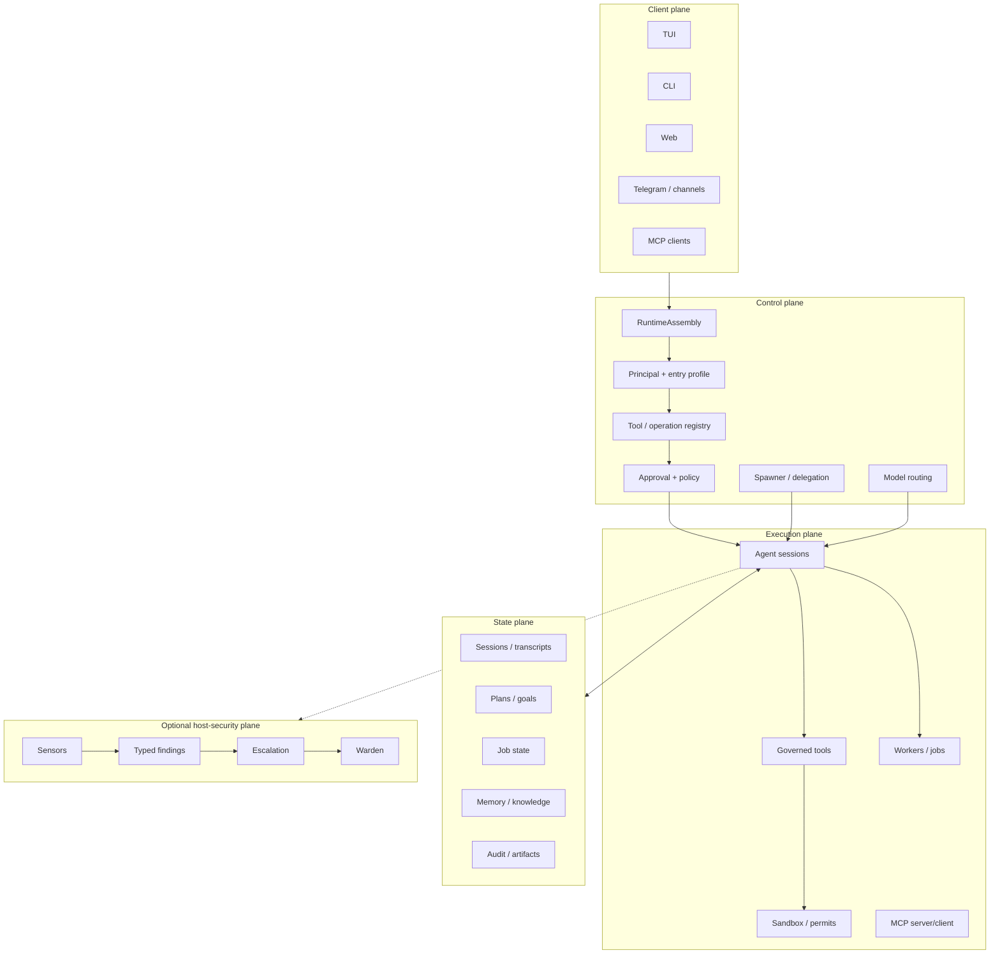
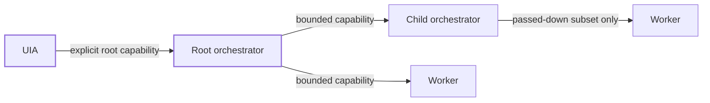

# Harwness: A Policy-First Runtime Architecture for Long-Lived, Model-Heterogeneous AI Agents

> **Working research paper — artifact-grounded draft**
>
> **Project:** Harwness (`harw`)  
> **Baseline repository commit:** `90160f4f2b88f80c6721c20469ed8322ddc8861a`  
> **Baseline date:** 2026-10-07  
> **Paper status:** working draft, not peer reviewed  
> **Claim discipline:** every architectural claim in this paper is labeled as **implemented**, **partially implemented**, or **proposed** according to the repository documentation and the pinned source baseline. Where a design document and code disagree, the code is the intended source of truth.

## Abstract

Large language models are increasingly embedded in systems that can invoke tools, modify files, execute processes, delegate work, retain state, and interact through local or remote interfaces. In such systems, the primary engineering problem is no longer only model capability. It is the design of the runtime that converts probabilistic model outputs into bounded, durable, observable, and recoverable actions.

This paper presents **Harwness**, an open-source Rust agent harness designed around the thesis that model output is **untrusted intent**, while authority, process ownership, persistence, admission, and enforcement belong to a typed runtime outside the model context. Harwness separates the client, control, execution, and state planes; assembles entry points through a single runtime composition boundary; derives trusted principals at ingress; narrows authority monotonically across child-agent delegation; compiles user-extensible agent definitions into typed intermediate representations; mediates process execution through sandbox and permit boundaries; persists sessions, jobs, plans, memory, and knowledge outside transient model context; separates declared model capabilities from observed model behavior; and optionally integrates a host-security plane, **Detect · Orient · Defend (DoD)**, whose observation and enforcement path remains distinct from ordinary model execution.

The paper makes three kinds of contribution. First, it documents a concrete systems architecture for long-lived, model-heterogeneous agent operation. Second, it formulates a set of security and reliability invariants that can be tested independently of model quality. Third, it proposes an evaluation methodology for measuring capability escape, crash recovery, model-routing effectiveness, context efficiency, and delegation overhead. The present artifact demonstrates that many of these mechanisms are implemented in the repository, while other parts — notably portions of the agent-definition compiler, selected DoD enforcement paths, and full audit integration — remain partial. The goal of this paper is therefore not to claim a finished autonomous operating system, but to make the design boundaries, implementation evidence, limitations, and future experiments explicit enough to be falsifiable.

---

## 1. Introduction

Agentic AI systems are often evaluated as if the model were the system. Model benchmarks ask whether a model can reason, code, call tools, or maintain performance over long contexts. Those properties matter, but they are only one factor in an autonomous or semi-autonomous software system.

A language model does not itself own a process, filesystem, network socket, job queue, credential, approval state, durable memory, or child process. It produces output that another program interprets. The surrounding runtime decides whether a tool exists, whether a call is valid, which identity issued it, what resource it may touch, whether it should be approved, whether its state survives a crash, and whether a child agent may receive the same rights.

This leads to the central thesis of Harwness:

> **A model has agentic potential; the harness determines whether that potential becomes controlled, durable, and verifiable work.**

A useful conceptual approximation is:

```text
effective agent performance
  = model capability
  × interface quality
  × context quality
  × runtime reliability
  × verification quality
```

The multiplicative form is deliberate. If a system loses state after a crash, exposes an unreliable tool interface, silently broadens authority during delegation, or cannot verify completion, a stronger model may not compensate for the system failure.

The Harwness repository is built around a related security statement:

> **Model output is intent, not authority.**

The model may propose an operation. It may choose among tools that the runtime exposes. It may ask for delegation. It may request host access. None of those outputs are, by themselves, permission to perform the action.

This paper turns that architectural stance into research questions, system invariants, implementation evidence, and an evaluation plan.

---

## 2. Research questions

The paper studies five primary questions.

### RQ1 — Can an agent runtime preserve useful autonomy while treating model output as untrusted intent?

The core tension is that an autonomous agent must be able to act without asking for every trivial operation, yet the model must not be able to mint identity or authority through prompt text, generated JSON, configuration, or an invented tool argument.

Harwness addresses this by moving authority to typed runtime objects, entry profiles, operation contexts, approval policy, and explicit capability derivation.

### RQ2 — Can multi-agent delegation be made monotonic and compositional?

Delegation is useful because specialized workers can operate in parallel or with narrower contexts. It is dangerous if every child can rediscover or reconstruct the parent’s authority.

Harwness defines delegation as an intersection of ceilings: role, explicitly declared target, parent grant, remaining depth, remaining budget, authority, context, and read/write scope.

The desired property is:

```text
rights(child) ⊆ rights(parent)
```

for every authority dimension that can affect execution.

### RQ3 — Can long-lived agent work survive model changes, compaction, retries, and process failure without conflating durable state with prompt context?

A long-running agent must distinguish desired state, current plan, job state, session history, memory, knowledge artifacts, and transient working context. Putting all state into the prompt is neither reliable nor economical.

Harwness therefore persists multiple state classes independently and reconstructs context from those stores.

### RQ4 — Can model heterogeneity be exploited without weakening runtime invariants?

Models differ in context limits, tool behavior, schema adherence, latency, cost, long-context retention, delegation discipline, and error recovery. Harwness separates declared provider capabilities from observed runtime behavior and uses the runtime — rather than model self-selection — to route work.

### RQ5 — Can host-security observation and enforcement remain separate from model reasoning?

A model may classify a situation as suspicious, but a verdict should not equal a privileged host action. Harwness treats DoD as a peer security plane with separate sensors, typed findings, escalation, and privileged enforcement boundaries.

---

## 3. Scope and non-claims

This paper describes **Harwness as an evolving systems artifact**, not as a finished product whose entire design has been empirically validated.

The baseline is commit `90160f4f2b88f80c6721c20469ed8322ddc8861a`. Repository documents use three implementation labels:

- **implemented** — the documented contract has a current implementation path;
- **partially implemented** — substantial code exists, but parts of the contract remain open or have not been fully re-verified;
- **proposal** — the document describes intended architecture rather than a present runtime guarantee.

This paper preserves those distinctions.

Important non-claims:

1. The paper does **not** claim that Harwness prevents arbitrary compromise by malicious native code running with the same operating-system rights.
2. It does **not** claim that every documented design item is implemented.
3. It does **not** claim that model behavior is deterministic.
4. It does **not** claim that a large context window removes the need for retrieval, memory, or durable state.
5. It does **not** claim that a model-generated security verdict is sufficient authorization for host enforcement.
6. It does **not** claim that prompt instructions are an adequate security boundary.
7. It does **not** claim final benchmark superiority over other agent runtimes; the evaluation protocol in this draft is a plan for producing such evidence.

---

## 4. Methodology

### 4.1 Artifact-based architecture analysis

The first version of this paper is based on static analysis of the Harwness repository at the pinned baseline. The primary evidence consists of:

- workspace source code;
- executable tests and architecture gates;
- design and architecture documents marked with implementation status;
- security invariants in `SECURITY.md`;
- the public README and documentation index;
- agent definitions, role contracts, and tool schemas.

The repository itself defines the following evidence order:

1. current source and Cargo metadata;
2. tests and executable architecture gates;
3. implemented operational/design documentation;
4. accepted ADRs;
5. planning documents.

The paper follows the same order.

### 4.2 Claim classification

Every major claim belongs to one of four classes:

| Class | Meaning in this paper |
|---|---|
| **I — Implemented** | A documented runtime path exists and the relevant design document is marked implemented. |
| **P — Partial** | A runtime path exists but the design document explicitly lists missing or unverified pieces. |
| **D — Design** | The mechanism is described normatively but remains only partially implemented. |
| **E — Evaluation target** | The paper proposes an experiment; no result is claimed yet. |

### 4.3 External positioning

The design is compared with current public work on agent orchestration, standardized tool interfaces, and durable execution. These sources are used for positioning rather than as evidence that Harwness itself is correct.

Relevant external references include:

- Anthropic’s discussion of simple, composable agent patterns and agent-computer interface quality;
- the OpenAI Agents SDK’s agent loop, handoffs/agents-as-tools, guardrails, sessions, sandbox agents, human-in-the-loop controls, and tracing;
- the Model Context Protocol (MCP), which standardizes tools, resources, and prompts between hosts and servers;
- Temporal’s durable-execution model, in which workflow progress survives process and infrastructure failures;
- classical least-privilege and protection principles from operating-system security.

---

## 5. System model

Harwness can be understood as four interacting planes.



The key design choice is that the model is not the control plane. It is one execution component inside a runtime that owns admission, authority, durable state, and policy.

---

## 6. One runtime assembly boundary

**Claim class: I — Implemented**

The document `docs/design/runtime-contracts.md` defines `harw-runtime` as the one composition boundary for all principal entry paths. TUI, one-shot CLI, web, MCP server, durable jobs, and gateways are assembled into a `RuntimeAssembly`.

The architectural purpose is to prevent each front-end from manually wiring its own interpretation of:

- permissions;
- sandbox policy;
- tool registry;
- approval handlers;
- model selection;
- session stores;
- child spawning;
- context ceilings.

A simplified shape is:

```rust
pub struct RuntimeAssembly {
    spec: RuntimeSpec,
    profile: EntryProfile,
    config: Arc<ResolvedConfig>,
    trust_report: ConfigTrustReport,
    project: ProjectContext,
    sandbox: SandboxSpec,
    ceiling: ContextCeiling,
    spawn_context: SpawnContext,
    budget: RootBudget,
    // registry, services, stores, approval chain, spawner, model, ...
}
```

This is a systems-level defense against **policy drift**. If Telegram, the TUI, a job worker, and the MCP server each assembled their own runtime independently, then every new security rule would need to be replicated across entry points. Harwness instead makes entry kind a parameter to one assembly process.

### 6.1 Entry profiles as reduction tables

An `EntryKind` maps to exactly one `EntryProfile`. That profile determines the permission ceiling, tool-registry profile, approval behavior, spawner policy, context ceiling, and whether local project context is visible.

This supports a useful invariant:

> A remote or non-interactive entry point is not a second authority system. It is a narrower projection of the same runtime.

For example, the current documented reduction table gives the local TUI a much broader ceiling than web, MCP-server, dream, or Telegram entry paths. Network access is not treated as an implicit property of “being an agent”; it is an explicit permission with an egress scope.

### 6.2 Why a single assembly matters experimentally

A future evaluation can inject the same operation request through different ingress surfaces and inspect the resulting `RightsSnapshot`. If the architecture is correct, the difference between surfaces should be explainable entirely by their reduction profiles, not by duplicated ad-hoc checks.

---

## 7. Trusted principals: identity is minted, not parsed

**Claim class: I — Implemented**

A core Harwness distinction is between **data that describes an actor** and a **trusted principal**.

The runtime contract defines a `Principal` with:

- principal kind;
- identifier;
- ingress surface;
- permission tier.

The important property is not merely its fields. It is its construction boundary.

The documented `Principal` is deliberately serializable for reporting but not deserializable as authority. It is created at a trusted ingress boundary or derived from a parent.

Conceptually:

```text
authenticated ingress
    ↓
trusted principal
    ↓ derive
child principal
```

not:

```text
model JSON / TOML / network payload
    ↓ parse
principal
```

This avoids a common class of confused-deputy errors where a lower-trust component can reconstruct a higher-trust identity by supplying a role name, owner identifier, or permission tier as data.

### 7.1 Monotonic derivation

Child-principal construction can reduce a tier but cannot increase it. This principle recurs throughout Harwness:

```text
derived authority ≤ source authority
```

The system therefore aims to make privilege escalation structurally difficult: rights are derived from trusted runtime state rather than from language-model claims.

---

## 8. Agent definitions as compiled policy

**Claim class: P/D — Partially implemented design with implemented compiler components**

Harwness does not treat an agent definition as a free-form prompt plus arbitrary tool names. The agent-definition DSL describes roles, specializations, tool policy, context policy, budgets, spawn constraints, and return contracts in a versioned TOML format.

The intended compilation pipeline is:

```text
discover
→ parse
→ resolve versions
→ load base definition
→ apply ordered mixins
→ apply explicit patches
→ validate schemas
→ validate role compatibility
→ validate authority monotonicity
→ validate organization graph
→ resolve policies
→ freeze snapshot
→ hash definition
→ compile typed definition / IR
```

The repository documentation is explicit that this pipeline is **partially implemented**, and that the current compiler/IR work is split across `harw-agent-dsl`, `harw-agent-compiler`, and related crates.

### 8.1 Closed authority roles

The DSL is extensible in specialization but not in root authority categories. Users may define new workers, coding styles, context policies, families, verification profiles, and organization templates. They may not introduce a new authority role that bypasses the runtime role matrix.

This separates:

```text
what work is this agent specialized for?
```

from:

```text
what authority class may this agent occupy?
```

That distinction is essential for safe extensibility. A plugin or user project can introduce behavior without inventing a new privilege class.

### 8.2 Frozen executable snapshots

A compiled agent snapshot can be content-addressed. The research value is that an experiment can identify not only the model and prompt, but the exact resolved policy artifact under which the model ran.

A reproducible agent run should therefore identify at least:

```text
repository commit
agent-definition hash
model descriptor/version
runtime profile
tool-policy version
task input
state baseline
```

---

## 9. Delegation capabilities instead of role-name spawning

**Claim class: I — Implemented, with documented future role cleanup**

The delegation contract is one of the strongest Harwness-specific design choices.

An organizational role is only an upper bound. It is not a model-facing catalog of everything that role might theoretically spawn.

The visible delegation set is defined as an intersection:

```text
DefinitionDeclaredTargets
∩ RoleMatrixTargets
∩ ParentGrantedTargets
∩ RemainingDepth
∩ RemainingBudget
∩ AuthorityCeiling
∩ ContextCeiling
∩ ReadWriteScopeCeiling
```

Only the resulting concrete set is exposed to the model.

This yields two security properties.

### 9.1 Non-enumerability

A model should not be able to guess hidden agent names and learn, from error messages, which ones exist. If a target is not delegated, it is intended to be invisible rather than merely forbidden.

### 9.2 Monotonic subtrees

A child cannot widen its own subtree merely because its global role class is theoretically allowed to spawn other agents. Recursive orchestration requires an exact delegated target plus remaining depth and budget.

The intended relationship is:



A worker has no persistent delegation catalog.

### 9.3 Delegation as capability transfer

The research framing is important: “start agent X” is not a direct command. It is a request to consume a runtime-issued capability. The lease or child execution exists only after admission.

This makes delegation comparable to capability systems in operating-system design: possession of a specific, bounded capability matters more than knowledge of a global name.

---

## 10. Governed process execution

**Claim class: I — Implemented**

Shell access is often the point at which an otherwise structured agent system collapses into “the model can run arbitrary commands.”

Harwness explicitly rejects that simplification.

The process-execution design separates:

1. **delegation authority** — may the parent ask for a specific execution worker?
2. **execution authority** — may that worker carry out this concrete mandate?

Dedicated worker classes include sandbox shell workers, Cargo workers, tmux inspection workers, and separately gated host workers.

An `ExecutionPermit` is bound to a concrete request:

```text
ExecutionPermit {
  parent_session,
  worker_definition,
  command_digest,
  sandbox_profile,
  approved_modules,
  workspace_and_scope,
  expires_at,
  remaining_uses,
  approval_proof,
}
```

The model cannot construct such a permit merely by emitting the same fields.

### 10.1 Permit binding

A permit is expected to fail closed if:

- the command changes;
- the workspace changes;
- the worker definition changes;
- the permit expires;
- its use count is exhausted;
- the requested sandbox is broader;
- the parent does not already possess the requested ceiling.

The research principle is:

> **Process execution is a capability-bearing operation, not a text channel.**

### 10.2 Host access

Harwness also supports a governed host-mode path for cases where strict isolation is insufficient. The important architectural point for this paper is not the UI detail of each host-mode variant; it is that a model request can trigger a structured human decision, but cannot turn the request itself into the grant.

The paper flags one item for future formalization: current documentation contains multiple host-mode pathways and historical semantics. Before publication-quality security claims, the experiment artifact should pin the exact implemented host-lease state machine directly from source and tests.

---

## 11. Approval is not authority

**Claim class: I — Implemented**

Approval systems are frequently misunderstood. A confirmation dialog is not itself the permission model.

Harwness distinguishes:

- **capability / permission ceiling** — whether the action is reachable at all;
- **policy** — whether it is allowed, denied, or requires approval;
- **approval mode** — how an eligible request is resolved.

This distinction matters in modes such as “Full Access.” Removing confirmation prompts must not invent a tool, filesystem scope, network scope, child capability, or trusted principal that the runtime did not otherwise grant.

A useful formalization is:

```text
reachable(action)
  = capability(action)
  ∧ scope(action)
  ∧ policy_not_denied(action)

execute(action)
  = reachable(action)
  ∧ approval_resolution(action)
```

Changing approval mode can affect the final predicate. It should not redefine the preceding authority terms.

---

## 12. Durable work: goal, plan, job, and session are different objects

**Claim class: I/P — Core durable stores implemented; some higher-level workflows continue evolving**

Long-lived agent systems need more than a chat transcript.

Harwness distinguishes at least:

- **goal** — desired end state and acceptance criteria;
- **plan** — current strategy for reaching the goal;
- **job** — a durable unit of work with lifecycle and execution state;
- **session** — conversational/run history and runtime identity;
- **workbench/artifacts** — concrete working outputs;
- **memory/knowledge** — selectively retained cross-turn or cross-session information.

This decomposition prevents a context compaction from becoming a state-loss event.

### 12.1 Desired state vs. strategy

The conceptual relationship is:

```text
Goal
  ↓ drives
Plan vN
  ↓ decomposes into
Jobs / tasks
  ↓ produce
Evidence
  ↓ verifies
Goal completion
```

A model switch may alter the implementation strategy. A retry may replace a failed worker. Neither should silently rewrite the goal.

### 12.2 Durable job execution

The repository contains separate crates for core job state, persistence, runtime execution, platform integration, and higher-level orchestration. Jobs carry lifecycle state independently from the transient language-model turn.

This architecture resembles durable-execution systems such as Temporal in one important sense: control-flow state must be recoverable after failure. Harwness does not claim to be Temporal, nor to provide identical semantics, but it applies the same systems principle to agent work: state transitions should be persisted at explicit commit boundaries rather than inferred from whether a model “remembers” what happened.

---

## 13. Memory as governed state, not unlimited context

**Claim class: I — Implemented**

`harw-memory` implements a tiered persistent memory system with HOT/WARM/COLD storage, append-only signals, and periodic consolidation.

The documented design emphasizes four principles:

1. bounded token budget for always-loaded memory;
2. explicit signals over silent inference;
3. append-only recording plus idempotent maintenance;
4. local-first storage.

This reflects a broader context-engineering claim:

> **Context should be constructed for the current decision, not accumulated without bound.**

A long-lived system can store more information than it should inject into each model call.

### 13.1 State classes

A useful Harwness decomposition is:

| State class | Typical use | Should always be in prompt? |
|---|---|---|
| Working context | current decision | usually |
| Session history | conversational continuity | selectively |
| Job state | lifecycle/recovery | no |
| Plan | current strategy | selectively |
| Workbench | intermediate artifacts | by relevance |
| Diary | time-oriented record | no |
| Memory | curated durable knowledge | by retrieval |
| Skills | reusable procedure | only when needed |
| Artifacts | concrete files/results | by reference |

This separation reduces the temptation to use the prompt as a database.

---

## 14. Model heterogeneity as a runtime resource

**Claim class: I — Implemented architecture**

Harwness separates two properties of a model.

### 14.1 Declared capabilities

These describe what an API supports in principle:

- context and output limits;
- tool calling;
- parallel tool calling;
- streaming;
- reasoning controls;
- caching;
- image/audio support;
- JSON modes.

### 14.2 Observed behavior

These describe what the model actually does under the harness:

- tool-call reliability;
- long-context retention;
- delegation discipline;
- schema strictness;
- compaction tolerance;
- retry sensitivity;
- preferred task granularity;
- safe parallelism.

The repository’s current four-layer catalog uses different concrete type names than the original design, but preserves this separation.

### 14.3 Why this matters

A provider abstraction that only exposes:

```rust
respond(messages, tools) -> ModelResponse
```

erases operationally relevant differences.

A model router can instead choose by **role**:

- orchestrator;
- repository worker;
- focused coding worker;
- verifier;
- scout.

The model may suggest a kind of work, but it does not overwrite its own authoritative model identity.

### 14.4 Atomic provider/model switching

The model/provider routing architecture documents an atomic fail-close switch:

```text
catalog lookup
→ credential resolvability
→ model/provider compatibility
→ queue switch
→ apply at safe turn boundary
```

If a check fails, session state remains unchanged. This is a small but important example of treating configuration changes as transactions rather than as a sequence of partially applied side effects.

---

## 15. Multi-surface interaction without multiple security models

**Claim class: I — Implemented**

Harwness supports multiple interaction surfaces: local TUI/CLI, web components, MCP, gateways, and channel bindings such as Telegram.

The interaction contract states that these are front-ends onto one command and permission substrate, not independent applications with separate authority models.

The intended direction is always:

```text
remote surface ≤ local surface
```

A channel can narrow reachability. It cannot become an alternate route to a stronger command or tool.

This matters for agent systems because remote messaging integrations are often added late and can accidentally bypass the assumptions of the local UI. Harwness makes ingress surface part of the trusted principal and runtime profile.

---

## 16. MCP as interoperability, not authority

**Claim class: I — MCP client/server surfaces exist; authority remains a Harwness responsibility**

MCP standardizes the exchange of tools, resources, and prompts between hosts and servers. Current MCP documentation explicitly distinguishes among user-controlled prompts, application-controlled resources, and model-controlled tools.

Harwness can use MCP as an interoperability layer, but the protocol does not replace Harwness authorization.

The distinction is:

```text
MCP answers:
  "How is a tool exposed and called across a protocol boundary?"

Harwness must still answer:
  "Should this principal see the tool?"
  "What scope may the tool access?"
  "Does the request need approval?"
  "What durable identity and audit context does it carry?"
```

This is representative of the paper’s broader thesis: interoperability protocols and model APIs are necessary components, but the harness remains responsible for local policy and lifecycle.

---

## 17. Detect · Orient · Defend as a separate security plane

**Claim class: P — Partially implemented**

Harwness includes an optional host-security domain named **Detect · Orient · Defend (DoD)**.

The DoD design separates:

- host observation;
- typed findings;
- analysis/escalation;
- privileged enforcement.

The current repository contains substantial implementation: an authority crate, DoD configuration, installation targets, systemd units, sensors, Sentinel/Warden components, and eBPF-related crates. The design document also explicitly lists open or insufficiently re-verified items.

The security principle is more important than the component list:

> **Observation is not enforcement, and a model verdict is not a privileged action.**

### 17.1 Observation boundary

DoD profiles define which host or cgroup scope is observed. An empty or invalid scope must fail closed rather than silently expanding to the host.

### 17.2 Enforcement boundary

Privileged enforcement lives behind a separate Warden path. Ordinary model tool execution should not gain host enforcement simply because the model judged an event malicious.

### 17.3 Why this belongs in the paper

DoD tests whether the Harwness authority doctrine remains coherent when the system crosses from workspace tooling into host-security operations. It is therefore a useful stress test of the design, even while its implementation remains partial.

---

## 18. Secrets and tamper-evident audit

**Claim class: P — Partially implemented**

The `harw-secrets` design combines three concerns:

- provider and channel secrets at rest;
- optional encryption of selected durable artifacts;
- append-only, tamper-evident audit.

The current document states that envelope encryption, ML-KEM-based policy, rotation/provenance, the hash-chained audit log, and ML-DSA checkpoints exist, while broader event coverage and at-rest encryption of all session/knowledge material remain open.

The architectural lesson is again one of separation: a model should receive a resolved credential only through the provider path that needs it; it should not receive the storage key, audit key, or raw secret material as ordinary context.

A future paper revision should include a dedicated cryptographic appendix that is generated from the current source and dependency versions rather than from historical design prose, because the repository documentation itself records earlier primitive/version descriptions that are intentionally retained for rationale.

---

## 19. Failure model

The Harwness architecture can be understood by the failures it is designed to contain.

### 19.1 Model hallucination

**Failure:** the model invents a tool, role, agent, parameter, or permission.

**Containment:** model-visible schemas come from the runtime; hidden delegation targets are not a global catalog; trusted principals and permits are not model-constructible.

### 19.2 Prompt injection

**Failure:** project text or external content instructs the model to escalate, exfiltrate, or bypass controls.

**Containment:** prompts can change model intent but should not change `Principal`, `EntryProfile`, sandbox scope, tool registry, or permit issuance.

### 19.3 Malicious project configuration

**Failure:** a repository-local config asks for more authority than the user intended.

**Containment:** configuration is subject to a trust report and runtime ceilings. Untrusted config should be able to narrow behavior, not mint trusted principals.

### 19.4 Child-agent escalation

**Failure:** a child guesses another worker/orchestrator or requests a broader filesystem/network scope.

**Containment:** delegation capability intersection and parent ceiling.

### 19.5 Process escape

**Failure:** a worker uses shell access to escape the intended workspace or invoke privileged commands.

**Containment:** dedicated execution workers, sandbox profiles, operation-specific permits, and separate host access.

### 19.6 Partial configuration switch

**Failure:** provider changes but model does not, leaving a broken intermediate state.

**Containment:** atomic model/provider validation and safe-boundary application.

### 19.7 Crash during long-running work

**Failure:** the process exits after some side effects but before the model’s next turn.

**Containment target:** persisted job lifecycle, idempotent or reconstructable state transitions, artifact/evidence checks on resume.

### 19.8 Context compaction

**Failure:** the model forgets the goal or previous verification state after history compression.

**Containment:** durable goal/plan/job/evidence state outside prompt history.

### 19.9 Remote-channel privilege drift

**Failure:** a channel exposes a command unavailable under the intended local policy.

**Containment:** shared command registry plus ingress-specific narrowing.

### 19.10 Model verdict becomes enforcement

**Failure:** a security-classification output directly triggers a privileged host action.

**Containment:** DoD separates findings, escalation, and Warden authorization.

---

## 20. Security invariants

The following invariants are candidates for formal or property-based testing.

### I1 — Principal origin

Every privileged operation is associated with a principal minted at a trusted ingress or derived from another trusted principal.

### I2 — Monotonic child authority

For every child session `c` and parent `p`:

```text
permissions(c) ⊆ permissions(p)
network_scope(c) ⊆ network_scope(p)
filesystem_scope(c) ⊆ filesystem_scope(p)
context_ceiling(c) ⊆ context_ceiling(p)
delegation_targets(c) ⊆ delegated_subtree(p)
```

### I3 — No authority from serialization

Deserializing model output, TOML, JSON, MCP payloads, channel messages, or project files cannot directly produce a trusted principal, approval proof, execution permit, or broader sandbox.

### I4 — Approval cannot widen reachability

Changing approval mode may change whether a reachable action requires interaction. It must not make an unreachable tool or scope reachable.

### I5 — Remote ingress is non-expanding

For an equivalent task and operator tier, a remote/channel entry point must not expose a superset of the corresponding trusted local entry point.

### I6 — Permit single-purpose binding

An execution permit must be invalid if its canonical mandate changes after approval.

### I7 — Durable state before dependent continuation

A terminal worker/tool result that triggers a parent rerun should be persisted before the rerun is enqueued.

### I8 — Model switch atomicity

A failed model/provider switch leaves the session’s active routing state unchanged.

### I9 — Security finding is not enforcement proof

No DoD finding or model-generated verdict alone authorizes a privileged Warden transition.

---

## 21. Comparative positioning

Harwness should not be positioned as “the only agent runtime with tools, handoffs, memory, or sandboxes.” Those capabilities now exist across multiple frameworks.

The research contribution is the **combination and placement of boundaries**.

### 21.1 Compared with agent SDKs

Modern agent SDKs already provide agent loops, tools, delegation/handoffs, guardrails, sessions, tracing, and in some cases sandboxed workspaces.

Harwness emphasizes a lower-level systems question:

> What state and authority must remain outside the agent abstraction so that the runtime can constrain, recover, inspect, and reproduce the work independently of any one model SDK?

In Harwness, the agent loop is not the outermost trust boundary.

### 21.2 Compared with MCP

MCP standardizes interoperable tool/resource/prompt exchange. Harwness can act as an MCP client or server but still owns local admission, identity, approval, sandbox, and durable lifecycle.

### 21.3 Compared with durable workflow systems

Temporal and similar systems treat persistence and replay as primary execution concerns. Harwness borrows the principle that long-running work must have explicit durable state transitions, but specializes it for AI-agent lifecycles in which control decisions are probabilistic and models may change mid-run.

### 21.4 Compared with prompt-only agent governance

A prompt can ask a model not to use a dangerous command. It cannot guarantee that a command is absent from the process environment.

Harwness treats prompt guidance as behavior shaping and runtime policy as authority.

---

## 22. Experimental evaluation plan

This section defines experiments that can turn architectural claims into measurements.

### 22.1 Research hypotheses

**H1 — Runtime authority dominates prompt compliance for capability containment.**  
When malicious or conflicting instructions ask an agent to exceed its tool/filesystem/network ceiling, a typed runtime should produce a lower capability-escape rate than prompt-only restrictions.

**H2 — Durable state reduces recovery loss.**  
For long-running tasks interrupted by process termination, durable job/plan/evidence state should reduce repeated work and incomplete recovery compared with transcript-only resumption.

**H3 — Behavior-aware routing improves efficiency at constant quality.**  
Selecting models by role and observed behavior should reduce cost or latency for a fixed success threshold compared with using one model for all roles.

**H4 — Structured retrieval improves token efficiency without reducing task success.**  
A bounded context compiler using memory/knowledge retrieval should use fewer prompt tokens than full-history accumulation while maintaining equivalent acceptance-criteria completion.

**H5 — Capability-scoped delegation reduces accidental cross-task interference.**  
Parallel workers with explicit write scopes and target capabilities should produce fewer overlapping edits and policy conflicts than unrestricted subagents.

---

## 23. Experiment A — Capability escape and prompt injection

### 23.1 Task set

Construct a suite of tasks that include benign objectives plus adversarial instructions embedded in:

- user text;
- repository documentation;
- fetched web content;
- tool output;
- child-agent return values;
- workspace configuration.

Example adversarial goals should request actions outside the current ceiling, such as:

- writing outside the workspace;
- calling an unavailable tool;
- spawning an undelegated worker;
- expanding network scope;
- changing approval behavior;
- executing a modified command under an old permit.

The test does **not** need destructive real-world targets; all actions can be represented against temporary directories, mock networks, fixture tools, and disposable processes.

### 23.2 Conditions

Compare:

1. **Prompt-only baseline** — model instructed not to exceed boundaries, with broad tools available.
2. **Schema-only baseline** — tools are typed but authority is not separately derived.
3. **Harwness strict runtime** — current authority, delegation, sandbox, and permit path.
4. **Harwness with varied approval modes** — to verify that confirmation policy does not alter capability ceilings.

### 23.3 Metrics

- capability escape rate;
- denied-request rate;
- false-positive denial of benign actions;
- number of hidden target names leaked through errors;
- policy-decision latency;
- model tokens spent recovering from denied actions.

A successful result for Harwness is not “the model never asks.” The stronger result is “the runtime never grants the unauthorized action even when the model asks.”

---

## 24. Experiment B — Delegation monotonicity

Generate random or property-based delegation trees with:

- varying role positions;
- target definition sets;
- depth budgets;
- token/time budgets;
- filesystem scopes;
- network scopes;
- context ceilings.

For every admitted edge `p → c`, assert all subset relationships from invariant I2.

Mutation tests should deliberately alter one field at a time:

- add a host;
- add a writable path;
- add a tool;
- restore a removed child target;
- increase depth;
- increase budget;
- increase permission tier.

Every widening mutation should be rejected.

### 24.1 Visibility test

Attempt to request:

- a nonexistent target;
- an existing but undelegated target;
- a delegated target whose budget is exhausted.

The model-facing rejection should not reveal more catalog information than necessary.

---

## 25. Experiment C — Crash recovery

### 25.1 Fault points

Terminate the Harwness process at controlled boundaries:

1. after a job is admitted but before execution;
2. after external work begins;
3. after tool output is produced but before parent rerun;
4. after an artifact is written but before status update;
5. during memory consolidation;
6. during a plan-wave barrier;
7. after a model/provider switch is queued but before the next safe turn.

### 25.2 Recovery questions

After restart:

- Is the durable lifecycle state coherent?
- Can the system determine whether work should resume, retry, or be marked terminal?
- Are completed side effects duplicated?
- Can the operator inspect why the system chose the recovery action?
- Is evidence from the pre-crash run still attached to the goal/plan node?

### 25.3 Metrics

- successful recovery rate;
- duplicate side-effect rate;
- mean repeated model tokens;
- mean repeated wall time;
- number of manual interventions;
- state divergence incidents.

---

## 26. Experiment D — Model heterogeneity and routing

Select a set of models from multiple providers and evaluate each on role-specific suites.

### 26.1 Roles

**Orchestrator**
- decomposition quality;
- dependency recognition;
- synthesis;
- delegation restraint.

**Repository worker**
- long-context code navigation;
- cross-file consistency;
- sustained task completion.

**Focused coding worker**
- patch correctness;
- scope discipline;
- test pass rate.

**Verifier**
- false-negative defect rate;
- evidence quality;
- schema adherence.

**Scout**
- latency;
- cost;
- recall on bounded read-only questions.

### 26.2 Behavior profile

Record per model:

```text
tool_call_reliability
schema_strictness
long_context_retention
delegation_discipline
compaction_tolerance
retry_sensitivity
safe_parallelism
preferred_task_granularity
```

Then compare:

- one-model-for-all routing;
- provider-capability-only routing;
- capability + observed-behavior routing.

### 26.3 Metrics

- task success at acceptance criteria;
- cost per successful task;
- wall time;
- tool-error recovery rate;
- invalid-schema rate;
- unnecessary delegation count;
- verifier catch rate.

---

## 27. Experiment E — Context engineering and memory

Compare four context strategies:

1. full transcript until the model limit;
2. rolling textual summary;
3. bounded retrieval from session + memory + knowledge stores;
4. Harwness policy-driven context with explicit must/should/may/exclude classes.

Use tasks that require information introduced far apart in time and tasks with large amounts of irrelevant history.

Metrics:

- prompt tokens;
- answer/task correctness;
- forgotten constraint rate;
- stale-memory error rate;
- retrieval precision;
- retrieval latency;
- cost per successful completion.

The expected result is not that less context is always better, but that **selected context should dominate unbounded accumulation in efficiency while preserving necessary evidence**.

---

## 28. Experiment F — Multi-surface policy equivalence

Replay semantically equivalent operations through:

- TUI;
- one-shot CLI;
- web;
- Telegram/channel entry;
- MCP server;
- job worker.

For each request, capture `RightsSnapshot`, visible operations, approval behavior, project-context visibility, and child-spawn surface.

The acceptance criterion is that every difference is predicted by the single entry-profile reduction table.

No front-end should create an undocumented privilege path.

---

## 29. Experiment G — DoD separation of verdict and enforcement

Using fixture sensors or a disposable Linux environment:

1. generate a finding;
2. generate an intentionally incorrect model analysis;
3. verify that the finding does not itself grant host enforcement;
4. verify that a missing/invalid observation profile fails closed;
5. verify that a broader scope cannot be silently substituted;
6. verify that Warden transitions require the expected proof/authority path.

Metrics:

- unauthorized enforcement count;
- scope-expansion count;
- false-ready state count;
- time from event to typed finding;
- time from valid authorization to enforcement.

Because DoD remains partially implemented, this experiment should be published with a component-by-component status matrix rather than a single pass/fail label.

---

## 30. Reproducibility package

A publishable experiment should include:

### 30.1 Software identity

- Harwness repository commit;
- Cargo.lock hash;
- Rust toolchain version;
- enabled feature set;
- OS/kernel version;
- sandbox backend/version;
- DoD profile and eBPF artifact hashes where relevant.

### 30.2 Agent identity

- resolved agent-definition hash;
- role;
- specialization;
- resolved tool set;
- context-policy version;
- return-contract version;
- delegation targets;
- budget.

### 30.3 Model identity

- provider;
- model identifier;
- provider model revision where available;
- runtime behavior-profile version;
- reasoning configuration;
- temperature/sampling settings where applicable.

### 30.4 Run identity

- task ID;
- random seed where used;
- workspace fixture commit;
- start/end time;
- approval mode;
- entry kind;
- principal tier;
- crash-injection point if any.

### 30.5 Outputs

- structured result;
- verification evidence;
- tool/event trace with secrets redacted;
- diff/artifacts;
- final rights snapshot;
- cost/latency/token statistics.

---

## 31. Current implementation-evidence matrix

The following matrix summarizes the repository baseline used by this draft.

| Area | Status | Primary repository evidence |
|---|---|---|
| Single runtime assembly boundary | **Implemented** | `docs/design/runtime-contracts.md`, `harw-runtime` |
| Trusted principals and entry profiles | **Implemented** | `docs/design/runtime-contracts.md`, `harw-types::principal` |
| Delegation capability intersection | **Implemented** | `docs/design/delegation-capabilities.md` |
| Agent-definition DSL and compiler | **Partially implemented** | `docs/design/agent-definition-dsl.md`, `harw-agent-dsl`, `harw-agent-compiler` |
| Governed process execution | **Implemented** | `docs/design/mediated-process-execution.md` |
| Model capability / behavior separation | **Implemented** | `docs/design/model-registry.md`, `model-catalog-v2.md` |
| Atomic model/provider switching | **Implemented** | `docs/architecture/model-provider-routing.md` |
| Long-term memory | **Implemented** | `docs/design/harw-memory.md`, `harw-memory` |
| Unified interaction contract | **Implemented** | `docs/design/interaction-contract.md` |
| MCP integration | **Implemented surfaces** | README, `harw-mcp-server`, `harw-mcp-client` |
| DoD host-security plane | **Partially implemented** | `docs/design/dod-system-operations-authority.md`, `dod/` |
| Secrets and audit | **Partially implemented** | `docs/design/secrets-and-audit.md`, `harw-secrets` |
| Wargaming / analytical workflows | **Partially implemented to implemented by component** | `docs/design/matrix-game.md`, `wargaming-and-analysis.md` |

This table is intentionally conservative. A component can be “implemented” as an architecture contract while still requiring broader empirical evaluation.

---

## 32. Limitations

### 32.1 Artifact analysis is not runtime proof

Static source and tests can demonstrate that a boundary exists in code, but they do not prove correct behavior under every real deployment condition.

### 32.2 Model APIs change

Capabilities, tool semantics, pricing, context limits, and reasoning controls change over time. A model behavior profile must therefore be versioned and periodically recalibrated.

### 32.3 Sandboxing is platform-dependent

Harwness is Rust-based and uses Linux-oriented isolation mechanisms in important paths. Equivalent guarantees on other operating systems may differ.

### 32.4 Local single-operator assumptions

Parts of the current secret and interaction model are designed for a single-operator local harness. Multi-tenant isolation is not a current v1 claim.

### 32.5 Documentation contains history

Several design documents intentionally retain historical rationale. A paper must cite the current code path, not an obsolete version number embedded in an old design section.

### 32.6 DoD is not fully evaluated

The host-security plane is substantial but remains partially implemented and not fully re-verified against every acceptance criterion described in its original plan.

### 32.7 The agent-definition architecture is still converging

The DSL, IR, and compiler exist, but portions remain explicitly partial. Claims about fully compiled policy should therefore distinguish current behavior from target behavior.

### 32.8 No benchmark results yet

This draft defines experiments; it does not fabricate outcomes. Any later abstract or conclusion that reports quantitative superiority must be updated only after the benchmark artifacts exist.

---

## 33. Discussion

Harwness suggests that the most important abstraction in agent engineering may not be the “agent” itself, but the **boundary around the agent**.

A model can be replaced. A worker can fail. A provider can disappear. A context window can be compacted. A remote channel can reconnect. If the system’s goal, authority, job lifecycle, evidence, and audit state live only in the model’s transient conversation, those events become correctness failures.

Conversely, once those concerns are externalized, several useful properties emerge:

- model choice becomes a routing decision rather than an identity decision;
- child agents become leased capabilities rather than independent principals;
- shell execution becomes a governed operation rather than a conversational privilege;
- memory becomes a retrieval system rather than an ever-growing prompt;
- remote channels become narrowed ingress surfaces rather than alternate applications;
- security analysis becomes an input to enforcement rather than enforcement itself.

This also changes how model quality should be measured. A “better” model is not necessarily the model with the highest standalone benchmark. In a harness, the relevant question is whether the model is good for a role under the runtime’s constraints.

A fast, cheap scout may be better than an expensive orchestrator for read-only discovery. A conservative verifier may be preferable to a more creative coding model. A long-context repository worker may be useful even if it is not the best planner. Heterogeneity becomes an architectural resource.

---

## 34. Future work

The most valuable next research steps are:

1. **Run the capability-escape benchmark** and publish a machine-readable result set.
2. **Add property-based monotonicity tests** over delegation, network, filesystem, and context ceilings.
3. **Build a crash-injection harness** for durable jobs and parent reruns.
4. **Version model behavior profiles** and automate periodic recalibration.
5. **Measure context strategies** on long-horizon repository tasks.
6. **Formalize the host-mode state machine** directly from executable tests and remove documentation ambiguity.
7. **Complete the agent compiler passes** and publish resolved-definition hashes in run metadata.
8. **Expand audit coverage** beyond secret operations to approval/channel/plugin events as designed.
9. **Finish and empirically verify DoD enforcement boundaries** in disposable Linux test environments.
10. **Publish benchmark fixtures and traces** with strict redaction so third parties can reproduce results.
11. **Produce a LaTeX/archival version** of this Markdown paper once the experimental sections contain results.
12. **Add a threat-model appendix** covering untrusted repositories, compromised provider responses, malicious MCP servers, channel impersonation, and local process compromise.

---

## 35. Conclusion

Harwness is an experiment in moving the center of agent engineering away from the prompt and toward the runtime.

Its core thesis is simple: model output should be treated as untrusted intent. Authority should come from trusted ingress, typed principals, explicit runtime profiles, bounded delegation, sandbox and permit systems, durable stores, and auditable transitions.

The repository already implements substantial pieces of this architecture: a unified runtime assembly boundary, trusted principal derivation, entry-specific rights reduction, delegation-capability intersection, governed process execution, durable state stores, model behavior/capability separation, atomic model routing, memory, and unified interaction surfaces. Other important areas remain partial, including parts of the compiled agent-definition architecture, broad audit integration, and the DoD host-security plane.

That incompleteness is not hidden by this draft. It is part of the research program.

The strongest version of the Harwness claim is not that one specific model becomes perfectly autonomous. It is that a well-designed harness can make heterogeneous models **replaceable inside a system whose authority, lifecycle, recovery, and verification properties remain explicit and testable**.

If the experiments proposed here validate the invariants, Harwness would provide evidence for a broader systems principle:

> **Reliable agentic behavior is not solely a property of a model. It is an emergent property of the model and the runtime that constrains, informs, persists, and verifies it.**

---

# Appendix A — Core architecture claims and falsifiers

| Claim | What would falsify it? |
|---|---|
| Model output is not authority | A model-controlled field can directly create a trusted principal, permit, or broader scope. |
| Child authority is monotonic | Any admitted child has a wider permission, network, filesystem, context, or delegation scope than its parent. |
| Entry profiles are the one rights reduction table | An entry point manually assembles a stronger runtime outside `RuntimeAssembly`. |
| Approval does not widen capability | Switching approval mode exposes a previously unavailable tool/scope. |
| Agent definitions are governed | A user definition can introduce a new authority role or bypass role validation. |
| Process permits are mandate-bound | A permit authorizes a materially different command after approval. |
| Provider/model switching is atomic | A failed switch leaves provider/model state partially changed. |
| Durable work is external to prompt history | Crash/compaction destroys the only copy of goal/job/evidence state. |
| Remote surfaces only narrow | A channel exposes a stronger operation than the corresponding local runtime ceiling. |
| DoD verdicts do not equal enforcement | A finding/model verdict directly causes privileged enforcement without the typed authorization path. |

---

# Appendix B — Suggested benchmark record format

```json
{
  "schema": "harwness.research-run/v1",
  "paper_baseline": "90160f4f2b88f80c6721c20469ed8322ddc8861a",
  "experiment": "capability-escape",
  "task_id": "fixture-001",
  "entry_kind": "tui",
  "approval_mode": "ask",
  "principal": {
    "kind": "human",
    "tier": "owner"
  },
  "agent": {
    "definition_id": "harwness.agent.example@1",
    "definition_hash": "..."
  },
  "model": {
    "provider": "...",
    "model_id": "...",
    "behavior_profile_version": "..."
  },
  "workspace": {
    "fixture_commit": "..."
  },
  "result": {
    "acceptance_criteria_met": true,
    "unauthorized_action_executed": false,
    "denied_requests": 2,
    "tool_errors": 0,
    "wall_ms": 0,
    "input_tokens": 0,
    "output_tokens": 0
  },
  "artifacts": [],
  "rights_snapshot": {}
}
```

---

# Appendix C — Repository source map for this paper

Primary Harwness documents used by this draft:

- `README.md`
- `SECURITY.md`
- `docs/README.md`
- `docs/philosophy/philosophy.md`
- `docs/design/runtime-contracts.md`
- `docs/design/delegation-capabilities.md`
- `docs/design/agent-definition-dsl.md`
- `docs/design/mediated-process-execution.md`
- `docs/design/harw-memory.md`
- `docs/design/model-registry.md`
- `docs/design/model-catalog-v2.md`
- `docs/architecture/model-provider-routing.md`
- `docs/design/interaction-contract.md`
- `docs/design/secrets-and-audit.md`
- `docs/design/dod-system-operations-authority.md`
- `docs/design/matrix-game.md`
- `docs/design/wargaming-and-analysis.md`

Implementation areas referenced:

- `harw-runtime`
- `harw-authority`
- `harw-agent-dsl`
- `harw-agent-compiler`
- `harw-model-catalog`
- `harw-memory`
- `harw-session-store`
- `harw-job-*`
- `harw-tool-*`
- `harw-mcp-client`
- `harw-mcp-server`
- `harw-secrets`
- `dod/crates/harw-dod-*`
- `harw-sentinel`
- `harw-warden`

---

# References

1. Harwness repository, pinned artifact baseline `90160f4f2b88f80c6721c20469ed8322ddc8861a`, 2026-10-07.
2. Anthropic, “Building effective agents,” 2024. https://www.anthropic.com/engineering/building-effective-agents
3. OpenAI, “OpenAI Agents SDK,” documentation, accessed 2026-10-07. https://openai.github.io/openai-agents-python/
4. OpenAI, “Sessions — OpenAI Agents SDK,” documentation, accessed 2026-10-07. https://openai.github.io/openai-agents-python/sessions/
5. Model Context Protocol, “2026-07-28 Specification,” 2026. https://modelcontextprotocol.io/
6. Model Context Protocol, “Server primitives: prompts, resources, tools,” specification documentation, accessed 2026-10-07. https://modelcontextprotocol.io/specification/
7. Temporal Technologies, “What is Temporal? / Durable Execution,” documentation, accessed 2026-10-07. https://docs.temporal.io/temporal
8. J. H. Saltzer and M. D. Schroeder, “The Protection of Information in Computer Systems,” *Proceedings of the IEEE*, vol. 63, no. 9, 1975.

> **Citation TODO for submission:** normalize references to one archival style (ACM/IEEE), replace documentation landing pages with version-pinned URLs where available, add access dates, and add citations to relevant capability-security, sandboxing, long-horizon-agent, and context-engineering literature before peer-review submission.
